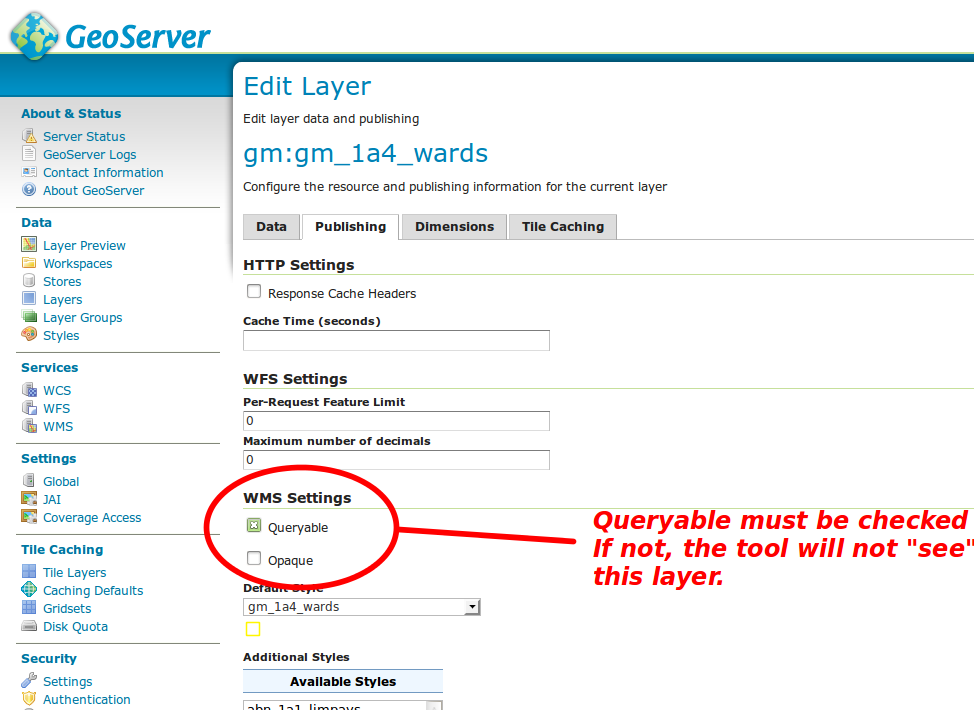

.. include:: ../substitutions.txt
.. |dashboard| image:: dashboard.png
.. |qmark| image:: windows_qmark.png
.. |anim| image:: animation.png
.. |fb| image:: fb.png
   :scale: 75 %
.. |b| image:: b.png
   :scale: 75 %
.. |pb| image:: pb.png
   :scale: 75 %
.. |pause| image:: pause.png
   :scale: 75 %
.. |pf| image:: pf.png
   :scale: 75 %
.. |f| image:: f.png
   :scale: 75 %
.. |ff| image:: ff.png
   :scale: 75 %
.. |pquery| image:: polygon_query_16px.png

.. _advanced_tools:

Avanced Interrogation tools
===========================

In the scope of this project, two tools related to interrogation have been implemented:

*   AdvancedFeatureInfo is an improvement of the standard interrogation tool (the
    *i*
    tool in the top toolbar of the map) aiming mostly at providing human-fancy labels instead of database-IDs, for the attributes of the queried layers.

*   PolygonalQuery is a new tool aiming at calculating basic statistics on a selected surface. It will apply only to specific raster layers like population.

AdvancedFeatureInfo
-------------------

Presentation
~~~~~~~~~~~~

This improvement replaces the previous standard interrogation tool. This is the tool that can be used by clicking on the
*i*
button in the map's top toolbar : it triggers the mouse in interrogation mode, meaning that, as long as you are in this mode, when you click on a place on the map, it will perform
a
query on each of the layers shown on the map.
*Thus, to use the interrogation tool, you have to check some of the layers, and click on a place covered by at least one queryable layer.*

.. note:: To quit the interrogation mode, you may click on the 'hand' button on its left. It will put you back in 'pan' mode (move the map).

The query will return a result for each entity under the mouse click, meaning you can have several returns for a single layer: if you click on the boundary between several polygons, for example, it will return all the polygons concerned by this boundary.

.. figure:: at1.png

   How the interrogation works

.. note:: An important thing to note is that it will only query layers that are made queryable. This is not set on the geoportal's side, it is defined in the WMS layer's definition, in the map server (GeoServer if using the geoportal 's standard map server).

**While the standard tool, in answer to a query, displayed a table of fields represented as pairs ID/value, the IDs being often plain, hardly understandable character 
strings, the advanced tools returns a table with the pairs label/value. The labels being entered through an interface that allows to set, for each of these previous IDs, 
a different label for each language available. It even allows setting some of these fields as hidden.**

.. figure:: at2.png

   Comparative output. Left: standard tool raw output. Right: advanced tool formatted output.

Features
~~~~~~~~

Queryable layers
^^^^^^^^^^^^^^^^

   Setting a layer as queryable, in GeoServer.
   
   
Nothing changed regarding this aspect, but it may be important to clarify how it works: the tool can get information only from layers that are made queryable. This is not configured by the geoportal itself, but rather on the map serves that are used. If using the standard GeoServer instance shipped with the geoportal, it is set on GeoServer, when defining the layer's configuration. By default, GeoServer sets its layers as queryable.

Chart layers, being some complex, composite layers, are not queryable.

Translation
^^^^^^^^^^^

Labels translation is the main purpose of this tool. First kind of translation is from computer-readable labels (database-friendly IDs) to human-readable labels. Second consideration is
matching the user's language.

The tool allows to translate the content to any of its supported languages. Since for now it supports English and French, those 2 languages are the only ones available.

Labels translation is set independently for each language. You can for example translate to nice labels in English only, but leave it raw for French version. 
Or hide different elements depending on the language used.

Hiding some fields
^^^^^^^^^^^^^^^^^^

It is indeed possible to hide some fields: when GIS people generate a geographic data, some of the attribute may be destined only to specific usage, and have no interest for end-users.

Hiding a field is as simple as setting its translation to ``#hide#``.

Managing the fields
~~~~~~~~~~~~~~~~~~~

.. figure:: at4.png
   :scale: 50 %
   :align: right

   Accessing to the Fields Manager.

For now, we have presented the results, but not the way to do it. Let us see how to proceed.

*   First, you need to be logged in the geoportal with an
    *Administrator*
    profile.

*   Then, you simply perform an interrogation, as would do a simple user (see illustration in Presentation chapter).

    You will notice a button that is not present when acting as unprivileged, simple user : on the top-right corner, a button called
    *Manage fields*
    . Clicking it will open the Fields Manager for the currently displayed layer (layer selected on the left part of the window).

*   In the Fields Manager window, first select the language (defaults to english), then start editing the fields translations: on the left is the default field label (its ID), on the right is the label. Click on the label to start editing it. Press enter when done.

.. figure:: at5.png
   :scale: 50 %
   :align: right

   Managing the fields.

Fields formatting
^^^^^^^^^^^^^^^^^

Changing a label is as simple as clicking it, typing the text and pressing enter when done.

But you can also perform some simple formatting, using basic
HTML
tags :

*   bold: enclose the text between ``<b>`` and ``</b>`` tags

*   italic: enclose the text between ``<i>`` and ``</i>`` tags

*   underline: enclose the text between ``<u>`` and ``</u>`` tags

*   colored text:
    enclose the text between
    ````
    and
    ````
    tags to make it red (for example)

.. figure:: at6.png

   Some examples of fields HTML formatting

Hiding a field
^^^^^^^^^^^^^^

.. figure:: at7.png
   :scale: 50 %
   :align: right

   Hiding fields.

Hiding a field is as simple as entering #hide# as its label. It is done independently for each language.

Live (non-persistent) testing
^^^^^^^^^^^^^^^^^^^^^^^^^^^^^

You can easily test the result before saving:

*   Make your changes

*   Move the Fields manager on one side, of close it

*   Click somewhere on your map to perform a new interrogation. The output should take into account your changes.

*   Adjust your labels, if they didn't suit your needs

*   Perform a new interrogation to check

*   etc.

*   When you're done, save your changes.

.. warning:: Until you save the changes, are your work is non-persistent: it is updated 'live' on your browser, but now saved on the server. Meaning that if you reload the page, you will loose any unsaved changes.

   Please note that it is also the way to cancel your changes: no need for a *reset* button: simply reload the page in your browser...

Saving
^^^^^^

On the bottom of the Fields Manager are two
*Save*
buttons. You can either:

*   save on a per-layer basis: you make your changes, then save, just the changes for this layer

*   save on a per-session basis: since all your changes are stored in your browser, you can choose to work on several layers, and save the whole at the end. For this, you will use the
    *Save all changes*
    button.

Technical Considerations
~~~~~~~~~~~~~~~~~~~~~~~~

Database concurrent access
^^^^^^^^^^^^^^^^^^^^^^^^^^

As explained in the Layertree Management tool's documentation, database concurrent write-access can be trouble.

Every tool storing data on a database is prone to concurrent write-access. Sometimes, it is a critical issue, like in the Layertree Management tool, since it could result in loosing some sensitive configuration work.

In this tool, however, not much could be lost. And since database concurrent write-access is something quite unlikely (the tool is available only for
*Administrator*
profiles, translating is a one-shot operation and is quite straight-forward), we estimated is was not worth the time and efforts necessary to deal with it.

Network resilience
^^^^^^^^^^^^^^^^^^

This is much more sensible : since network happens to be unreliable, network resilience had to be addressed. It is, in two ways:

*   when writing to the database: by wrapping the SQL request in a COMMIT statement, every transaction is stored in a unique bunch, making the whole data to be stored, or nothing at all in case of a failure. This ensures we don't break anything in case a failure happens in the middle of the process.

*   Suppose you loose internet connection while you are working on the translations. You didn't get time to save your changes. Since the changes are already stored locally on your browser, you just have to make sure you don't reload the page until you get your connection back. Then, you will be able to save all the changes, by clicking this
    *Save all changes*
    button. See the Troubleshooting section for more details on this scenario.

Known issues
^^^^^^^^^^^^

Layer groups
""""""""""""

Due to the way layer groups are handled in GeoServer, there is no way to get pretty-print with them: when performing an interrogation for a layer group, the result is given for each underlying layer, with no information about the layer group itself. And on the client side, we have no information of which layers the layer group is composed of.

As a consequence, making the layer groups compliant would require performing several requests to match the names, and result in a huge payload in terms of internet bandwidth consumption.

Bandwidth being on of the main preoccupations in the background, we decided not to
work on
layer groups interrogation:
it will be kept as it was with the basic interrogation tool. Layer groups are quite rare, and mostly regroup information also available in separate layers, so it should not be problematic.

A
s it is, if querying a layer group, the query tool will load and display raw results from the underlying layers. If you don't want this to happen, a workaround is to compose the layergroup from layers that are not made queryable: as a consequence, the layer group will not be queryable.

Troubleshooting
~~~~~~~~~~~~~~~

I lost my internet connection before I could save the changes
^^^^^^^^^^^^^^^^^^^^^^^^^^^^^^^^^^^^^^^^^^^^^^^^^^^^^^^^^^^^^

Don't panic ! Really, don't. First of all, don't reload the page.

*   Since the changes are already stored locally on your browser, you just have to make sure you don't reload the page until you get your connection back.

*   Wait for your connection to come back, then open again the geoportal in a new browser tab or window, and check your are still logged in. If not, log again (with your
    *Administrator*
    profile).

*   Come back to you first geoportal window (the one where you made the changes).

*   C
    lick th
    e

    *Save all changes*
    button.

*   C
    ome back to your second geoportal window.

*   Try an interrogation on one of the layers you edited, to check that the changes are saved. (checking on the same window will not work, since it will use the locally stored information, on the browser page, not from the database).

    It should be OK. If not, check again that you are logged in as administrator, and that your network is really back...

I can't query a layer !
^^^^^^^^^^^^^^^^^^^^^^^

Check the following points:

#.  Is the layer displayed on the map ? It must be visible on the map. If the layer is unchecked, it won't be queried.

#.  Is it a chart layer ? chart layers are not queryable.

#.  Maybe you clicked on a place on the map where the layer has no data. If the layer has no data on this place, it will return nothing.

If you didn't find your answer, then it is likely the layer is simply not queryable, as defined on the map server.

On the FeatureInfo panel, on the left, some of the row are blank
^^^^^^^^^^^^^^^^^^^^^^^^^^^^^^^^^^^^^^^^^^^^^^^^^^^^^^^^^^^^^^^^

See
*Layer Groups*
, in the
*Technical Considerations*
chapter.

.. |10000000000000420000002008059F76_png| image:: images/10000000000000420000002008059F76.png
    :width: 1.134cm
    :height: 0.55cm

.. |100000000000073F00000217376DCE46_png| image:: images/100000000000073F00000217376DCE46.png
    :width: 17.6cm
    :height: 5.075cm

.. |10000000000000470000001E15B90C19_png| image:: images/10000000000000470000001E15B90C19.png
    :width: 1.131cm
    :height: 0.478cm

.. |10000000000000420000001A30DF0EBB_png| image:: images/10000000000000420000001A30DF0EBB.png
    :width: 1.196cm
    :height: 0.471cm

.. |1000000000000048000000214C6C849F_png| image:: images/1000000000000048000000214C6C849F.png
    :width: 1.154cm
    :height: 0.529cm

.. |10000000000000460000001ECE99DE80_png| image:: images/10000000000000460000001ECE99DE80.png
    :width: 1.189cm
    :height: 0.51cm

.. |10000000000004DE0000019AF1DFF19F_png| image:: images/10000000000004DE0000019AF1DFF19F.png
    :width: 15.365cm
    :height: 5.055cm

.. |10000000000000470000001D7DCB0A45_png| image:: images/10000000000000470000001D7DCB0A45.png
    :width: 1.154cm
    :height: 0.471cm

.. |1000000000000777000002EE40EB3623_png| image:: images/1000000000000777000002EE40EB3623.png
    :width: 17.6cm
    :height: 6.907cm

.. |1000000000000700000002BF55217514_png| image:: images/1000000000000700000002BF55217514.png
    :width: 17.6cm
    :height: 6.904cm
    