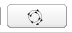
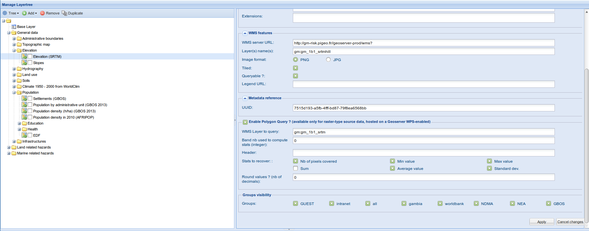

.. include:: ../substitutions.txt
.. |dashboard| image:: dashboard.png
.. |qmark| image:: windows_qmark.png
.. |anim| image:: animation.png
.. |fb| image:: fb.png
   :scale: 75 %
.. |b| image:: b.png
   :scale: 75 %
.. |pb| image:: pb.png
   :scale: 75 %
.. |pause| image:: pause.png
   :scale: 75 %
.. |pf| image:: pf.png
   :scale: 75 %
.. |f| image:: f.png
   :scale: 75 %
.. |ff| image:: ff.png
   :scale: 75 %
.. |pquery| image:: polygon_query_16px.png

.. _advanced_tools2:

Avanced Interrogation tools, part 2
===================================

PolygonalQuery
--------------

Presentation
~~~~~~~~~~~~

The
AdvancedFeatureInfo
tool, as well as the basic FeatureInfo tool before, only allows to perform punctual queries. While this satisfies many needs, there are some cases when you want to collect some information on a surface rather than on punctual locations. Say, for example, you need to know how many people live in a given area at risk. Or, you want to know the lowest, or the highest elevation in this area. You will not do this using punctual queries. You will use this new polygonal queries tool.

This tool will be available for only specific layers. You will just have to select a layer, draw on the map the polygon defining the area you want to query, and get the results.

|1000000000000777000002EE40EB3623_png|

Activate the tool
~~~~~~~~~~~~~~~~~

From the Organize tab (left panel), select a layer PolygonQuery-enabled (see picture above). The button in the toolbar will be made active. Click then on the button, and draw your polygon.

Limitations
~~~~~~~~~~~

The Polygon Query is only available for specific layers. They needs to comply to those criteria:

*   be
    **raster**
    layers

*   be served by a map server that supports WPS (Web Processing Services). For more information about this, see
    *Technical Considerations*
    .

*   be properly configured in the Layertree Manager (see
    *Configuration*
    ).

Features
~~~~~~~~

Collect statistics
^^^^^^^^^^^^^^^^^^

The Polygon Query tool collects statistics on a pre-configured band of the raster layer. The available statistics are:

*   Number of enclosed pixels (source raster data pixels)

*   Total sum of the values of the pixels (e.g. for population data, total population counted on this area)

*   Min value

*   Max value

*   Average value

*   Standard deviation

It is possible, in the configuration, to choose to hide some of these fields. For example, the Sum fields will not be relevant when dealing with elevation data.

Round values
^^^^^^^^^^^^

The calculated values are calculated with full-precision. It is often irrelevant ; it is thus possible to set the rounding level (number of decimals).

Set the header
^^^^^^^^^^^^^^

.. figure:: at10.png
   :scale: 50 %
   :align: right

   Custom header.

.. figure:: at9.png
   :scale: 50 %
   :align: right

   Standard results display.

The results display is quite simple : a header, followed by a pair name/values for each displayed statistic.

A default header is provided (“Collected statistics”), but you can set one of your own during the configuration.

If only one statistic is retained, the statistic name will not be displayed, assuming you will use the custom header to label the result.

Configuration
~~~~~~~~~~~~~

The configuration is done in the Layertree Manager administration, on the bottom of the form dedicated to any WMS layer (not available for Chart layers).

|1000000000000700000002BF55217514_png|

A checkbox “Enable Polygon Query ?” is unchecked, by default. If you want to activate the Polygon Query for this layer, you'll have to:

*   check the checkbox, of course

*   set the layer name to query. It is not necessarily the same name than the WMS one. For example, elevation layer may be, in WMS, a combination of elevation and hillshades. This combination will not be queryable, and you will want to query the source data, meaning the pure elevation data. In this example, the WMS layer may be called gm:gm_1b1_srtmhill, but you will set the single gm:gm_1b1_srtm layer for Polygon Query.

    If the layer field is left empty, the Polygon Query feature will be kept disabled.

*   Set the band number. It tells the system which band to query, on the raster data. Default is 0. If this is a single band raster, it is fine. If not, you may want to choose another band. Use the band number, not its label( if there is).

*   Set the header if you want it customized. If not, default header (“Collected Statistics”) will be displayed.

*   Choose the stats to compute. As said before, some of the values may be irrelevant depending on the kind of data you are dealing with.

*   Set the round level (number of decimals kept).
    Default is 0, which means integer values.

*   Apply the configuration for this layer (click button
    *Apply*
    ).

*   Save the Layertree configuration (menu Tree → Save to DB. See Layertree Manager documentation for more information).

Technical Considerations
~~~~~~~~~~~~~~~~~~~~~~~~

WPS
^^^

To be able to use the Polygon Query tool on a layer, WPS
(Web Processing Services)
protocol must be available for this layer.

This happens on the map server level. The standard geoserver used for the Geoportal has been set up with WPS support. External servers may not.

WPS allows to execute advanced processings on a layer. On of them extracts statistics from a raster dataset, based on a polygonal area. this is the process used for this tool. In GeoServer, the corresponding service is called ras:RasterZonalStatistics (
`http://pigeo.fr/geoserver-prod/web/?wicket:bookmarkablePage=:org.geoserver.wps.web.WPSRequestBuilder <http://pigeo.fr/geoserver-prod/web/?wicket:bookmarkablePage=:org.geoserver.wps.web.WPSRequestBuilder>`_
).

The available WPS processes can be listed using the GetCapabilities command (http://pigeo.fr/geoserver-prod/ows?service=wps&version=1.0.0&request=GetCapabilities)

Troubleshooting
~~~~~~~~~~~~~~~

When I draw the polygon on the map, how do I close it ?
^^^^^^^^^^^^^^^^^^^^^^^^^^^^^^^^^^^^^^^^^^^^^^^^^^^^^^^

The polygon closes on a double-click. Be careful not to move the mouse during the double-click.

The Polygon Query window hides the layers' list
^^^^^^^^^^^^^^^^^^^^^^^^^^^^^^^^^^^^^^^^^^^^^^^

Yes, it opens by default on top of the lateral panel, to leave the map area free, for the drawings. But you can freely move it to any place you want. You can even close it, it will open again when some information gets updated.

I get an Error trying to retrieve the stats. You may be experiencing network failures. If this error persists, please contact the portal\'s administrator message
^^^^^^^^^^^^^^^^^^^^^^^^^^^^^^^^^^^^^^^^^^^^^^^^^^^^^^^^^^^^^^^^^^^^^^^^^^^^^^^^^^^^^^^^^^^^^^^^^^^^^^^^^^^^^^^^^^^^^^^^^^^^^^^^^^^^^^^^^^^^^^^^^^^^^^^^^^^^^^^^^

If instead of the results you get this message, it is most likely that the layer is not properly configured.

I get weird statistics / negative values when I shouldn't
^^^^^^^^^^^^^^^^^^^^^^^^^^^^^^^^^^^^^^^^^^^^^^^^^^^^^^^^^

It is likely you have an issue with Nodata values for this layer: the places where there is no data are coded differently from a raster to another. Some put highly negative values. For example, AFRIPOP Nodata value is -9999. Therefore, if your query includes some pixels with nodata values, it will completely false your results.

A workaround, on the GIS level, would be to change the nodata values to 0 instead of -9999 for example.

.. |10000000000000420000002008059F76_png| image:: images/10000000000000420000002008059F76.png
    :width: 1.134cm
    :height: 0.55cm

.. |100000000000073F00000217376DCE46_png| image:: images/100000000000073F00000217376DCE46.png
    :width: 17.6cm
    :height: 5.075cm

.. |10000000000000470000001E15B90C19_png| image:: images/10000000000000470000001E15B90C19.png
    :width: 1.131cm
    :height: 0.478cm

.. |10000000000000420000001A30DF0EBB_png| image:: images/10000000000000420000001A30DF0EBB.png
    :width: 1.196cm
    :height: 0.471cm

.. |10000000000000460000001ECE99DE80_png| image:: images/10000000000000460000001ECE99DE80.png
    :width: 1.189cm
    :height: 0.51cm

.. |10000000000000460000001E4AF278FA_png| image:: images/10000000000000460000001E4AF278FA.png
    :width: 1.154cm
    :height: 0.496cm

.. |10000000000004DE0000019AF1DFF19F_png| image:: images/10000000000004DE0000019AF1DFF19F.png
    :width: 15.365cm
    :height: 5.055cm

.. |1000000000000777000002EE40EB3623_png| image:: images/1000000000000777000002EE40EB3623.png
    :width: 17.6cm
    :height: 6.907cm

    