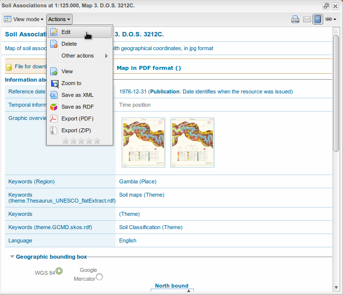
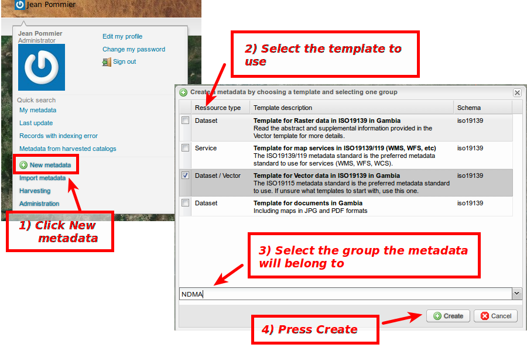

.. include:: ../substitutions.txt

.. _metadata_workflow:

Metadata workflow
=================

As a preliminary about Metadata, please read 
`Viewing and Analysing the Data <http://geonetwork-opensource.org/manuals/2.10.3/eng/users/quickstartguide/viewing/index.html>`_ 
in |gn| documentation.

Edit an existing metadata
-------------------------

To be able to edit a metadata, you must have the rights to. Meaning you must be logged in (see :ref:`login`), and be 

- either its owner (see :ref:`ownership`)

- or have a *Reviewer* or *Users Administrator* profile on the group the metadata belongs to

- or be an *Administrator*.

   Open the metadata in Edit mode

Usually, one would want to edit an existing metadata because some information are missing or incorrect. 
This means you already have a link to the metadata sheet, either by performing a search on the Geo-catalog
or by asking for the metadata from a cartographic layer (*Organize* tab).

In the metadata sheet, on the top toolbar, there is an *Action* menu. If you are logged and have edition rights, the first entry in the menu will be *Edit*.
Click it, it will open the metadata in Edition Mode.

Then, the edition is the same than when creating a new Metadata, except the fields are already filled up (at least some of them).

Create a new metadata
---------------------

   Create a new metadata
   
To create a new Metadata, you need to be logged in (see :ref:`login`), will an *Editor* profile or higher.

#. Open your personal menu (let the mouse over the User name in the top-right corner), in the menu, a *New metadata* entry should be there. Click it.

   It will open a window called "Create a metadata by choosing a template and selecting one group."

#. In this window, select the template from which the metadata will be created.

#. Then on the bottom *on this same window*, don't forget to select the group the metadata will belong to.

#. Press *Create*. It will open the new metadata sheet in *Edit* mode.

Then, for the edition, see 'the corresponding section <geonetwork-opensource.org/manuals/2.10.3/eng/users/quickstartguide/new_metadata/index.html>`_ in 
|gn| documentation.

Publish a metadata
------------------

Once the metadata has been created, it is available in the catalog, but only to people belonging to the group selected on the metadata creation (see above).

To make it fully available, you still have to set the privileges associated to the metadata, meaning the access rights.

.. figure:: openPrivileges.png
   :scale: 50 %
   :align: right

   Open the Privileges window

A user with *Editor* profile will have only restricted possibilities. A *Reviewer* and above will have all control on the privileges table.

Best way to find the newly created metadata is to open the personal menu and select *Last update* entry. It will perform a search over your owned metadata, 
order by update date, so the first metadata should be the one.

   
When letting the mouse over the metadata title, an *Action* menu should appear. Click on *Action*, it will open the menu. 
Then go to :menuselection:`Other actions --> Privileges`. It will open the Privileges table. 

.. figure:: privileges.png
   :scale: 50 %
   :align: right

   Setting the privileges
   
Below is a brief description for each privilege to help you identify which ones you should assign to which group(s).

**Publish**: Users in the specified group/s are able to view the metadata eg. if it matches search criteria entered by such a user.

**Download**: Users in the specified group/s are able to download the data.

**Interactive Map**: Users in the specified group/s are able to get an interactive map. The interactive map has to be created separately using a Web Map Server such as GeoServer, which is distributed with GeoNetwork.

**Featured**: When randomly selected by GeoNetwork, the metadata record can appear in the `Featured` section of the GeoNetwork home page. *Not used in the Geoportal interface.

**Notify**: Users in the specified group receive notification if data attached to the metadata record is downloaded.

Using Templates
---------------

For a description of the Templates as used in |gn|, see the corresponding 
`Templates section <http://geonetwork-opensource.org/manuals/2.10.3/eng/users/managing_metadata/templates/index.html>`_.

Templates can be very useful to gain some time when creating several quite similar metadata: create a template will all those metadata will have in common 
(points of contact, extent, common keywords, etc), and then create your metadata using this template, at the creation time.

To create a template is as simple as creating a new metadata: you go as if creating a new metadata, select an origin template, a group, go to the Edit form, edit the content, and then, in the top-left corner, 
*Record type* button, select Template in place of Metadata. Save and close. It's done, your new template is created. Set the privileges accordingly to the use you want to make of this template: 
you can keep it private or share it.

Actually, Templates are just some special metadata sheets, not visible when searching for metadata.

