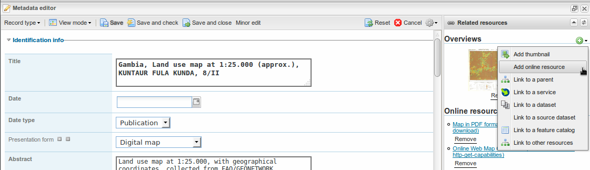
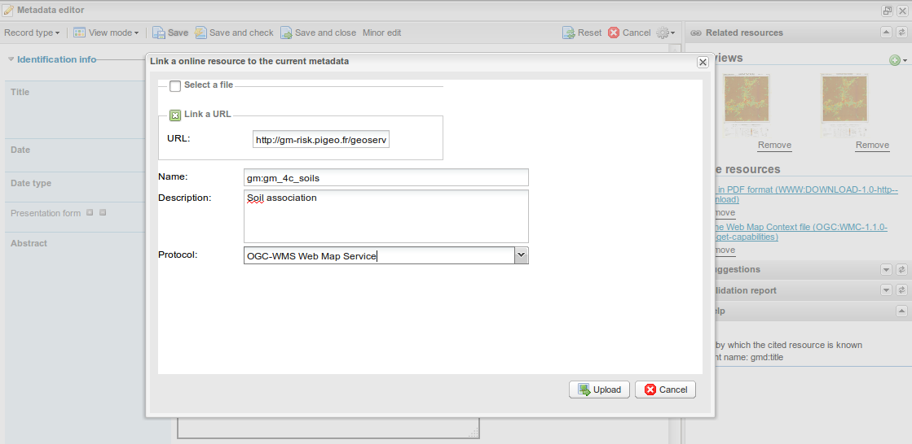

.. include:: ../substitutions.txt
.. |add| image:: add.png

.. _create_wms:

Create a WMS Layer
==================

If you want to attach a cartographic layer to the metadata you created, or if you want to add a layer to the *Select* tab, you will
probably have to create a new WMS (Web Map Service) layer.

This is not straightforward, as it means:

- Knowing at least a little about GIS.

- Learning how |gs| works.

- Putting the data on the server.

- Logging in |gs| and publishing the dataset in |gs|.

- Add the layer in |gn|

GIS basics
----------

It is important to have at least some basic knowledge about GIS (Geographic Information Systems).
**This is far beyond the purpose of this documentation. It is advised to have at least a short training about it.**

Why is it important ?
`````````````````````

Geographic data have some specific issues that, if not aware of, will make them very hazardous to manipulate.
For example, every GIS software makes the assumption that you know:

- The difference between vector and raster data

- The projection system used.

And this is a very minimum. 

Some GIS file formats can contain very different data. For instance, GeoTiff files can contain one-band data 
ranged between 0 and 255, or several bands of data with data taking arbitrary values (real values, actually, 
ranging, for example, between -2300 and +4000). 
Shapefiles are not one file, but a set of several files, can *should never* be separated. One file missing and the 
whole dataset is unusable.

Learning how |gs| works
-----------------------

|gs| is very well and fully explained in their `documentation <http://docs.geoserver.org/2.5.x/en/user/>`_. 
Please refer to it for |gs| use.

It is advised to install a |gs| instance on your computer, to train, test, and first publish your datasets. 
Then, when done on your computer, you will go and publish on the Geoportal's |gs| instance.

Putting the data on the server
------------------------------

After having properly published the data on your computer's |gs| instance, you will want to publish it on the Geoportal's |gs| instance.

In order to do this, you will first have to put the data on the server and get a credential to log in the |gs| instance.

To put the data on the server, you will have to address to the Geoportal's `System Administrator <jean.pommier@pi-geosolutions.fr>`_. 
Depending on whether you will publish data on a regular basis or very occasionally, he will grant you a write access on the server 
or you will have to give him the data, so he can put it himself.

To get a credential, you will have too to ask to someone having administrator rights in GeoServer. You may ask to the 
`System Administrator <jean.pommier@pi-geosolutions.fr>`_ too.

Logging in |gs| and publishing the dataset in |gs|
--------------------------------------------------

After you get your credentials, you will be able to log into the Geoportal's |gs| instance. Current address is 
`http://gm-risk.pigeo.fr/geoserver-prod/web/ <http://gm-risk.pigeo.fr/geoserver-prod/web/>`_.

While logged in, you will simply have to repeat the steps taken when first publishing the data on your computer's |gs| instance.

**Remember:** |gs| `documentation <http://docs.geoserver.org/2.5.x/en/user/>`_ is your friend !

Add the layer in |gn|
---------------------

There are two use cases:

- Attach the WMS layer to a metadata.

- Add the WMS layer in the *Select* tab (see :ref:`layertree`).

Attach the WMS layer to a metadata
``````````````````````````````````

This is done in the Edition form of the metadata. In the top-right`corner, click on the |add| button and select *Add online resource*.




   Open the 'new resource' form

This will open a window with a form. Check *Link a URL* and enter:

- **URL**: if using the Geoportal's |gs| server, it will be ``http://gm-risk.pigeo.fr/geoserver-prod/gm/wms?``

- **Name**: you will put the |gs|'s layer name. It will look something like ``gm:gm_4c_soils``

- **Description**: this is the text you want to be displayed in the metadata sheet, for the link to this layer. 
  This will usually be layer's name in human-readable terms. E.g. ``Soils association``
  
- **Protocol**: unless you know what you are doing, you will select ``OGC-WMS Web Map Service``



   
   Adding a WMS layer

Then press the *Upload* button (improperly named for this case) and that's all. It should show in the *Related Resources* panel in the top-right corner.

