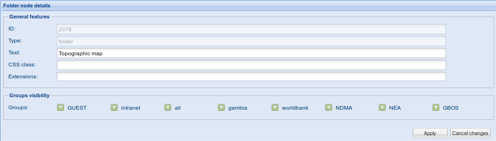

.. include:: ../substitutions.txt
.. |lt| replace:: Layertree


.. _layertree:

|lt| management
===============

.. note:: |lt| Management in reserved to *Administrator* profiles.

What we call here |lt| is the tree-like structure, on the *Select* tab, in the Geoportal interface. It organizes the cartographic layers in a 
hierarchical way, just as files are stored on your computer, in hierarchically organized folders.

This structure is now stored in the database, which opens new possibilities.

It is administered through a graphical user interface, which makes it easier to manage for non-technical people.

It now allows to define per-layer visibility privileges, which allows to fully customize accessible data, depending on the groups the user belongs to.

Accessing the Graphical Interface
---------------------------------

The Graphical Interface is accessible through the main administration page. Its access is granted only to people registered as Administrator.


.. figure:: admin-layertree.png

   Opening the Layertree Administration page.
   
A new entry in the administration interface has been added : Geoportal configuration. It will regroup all the additional administration tasks developed 
in the Geoportal scope. For now, there is only |lt| management.

“Manage |lt|” will show up only if you are properly identified as an Administrator.


.. figure:: lt-layout.png

   The page's layout
   
It opens an interface composed of 4 parts : 

- a menu on the top-left

- the tree structure on the left

- an empty (for now) panel on the right

- a “console” panel on the bottom.

Menu
````

The menu lists almost all the actions you can perform on the structure : Save/restore/export the tree, Add, remove or duplicate a layer/folder.
Those actions will be described further in this documentation.

Tree
````

The structure is exactly the same as what will be available in the public interface. An open folder, will result in a open folder in the public 
interface. A closed one will be closed. A checked layer will be checked  on the public interface (i.e. visible).

Right-panel
```````````

This is where the edition panels will be placed. It's content will depend on the pending action. We will explain each of them further down.

Console
```````

The console logs some information about the performed actions. Keeping an eye on it will ensure you that all performs smoothly

Conventions
```````````

In the following chapters, for convenience, we will call 'node' a tree node, i.e. a layer or a folder.

Editing a node
--------------

This is quite easy. Just click on a node, on the tree. A form will show on the right-panel, listing the node's attributes.

The 2 first fields are grayed, meaning you can't edit them. They are here for mere information.

A few (not much) fields in the form are common to all kinds of nodes. Most of them are specific.

At the bottom of the form, two buttons allow you to either cancel the changes (resets the form to previous values) or apply 
the changes (applies to the |lt|). **If you don't Apply, the changes won't be kept**.

Common fields
`````````````
- **ID**: unique ID attributed to the node. Non-editable (used internally in the database & code).

- **Type**: kind of node. Takes one of the following values : folder, wms, chart. Non-editable (used internally in the database & code).

- **Text**: this is what will be displayed in the layertree, the node's label.

- **CSS class**: 
   it is meant for easy-extending the features. For now, only 2 values are available: ``important`` (writes the name in bold) and ``grey`` (greys the name).
   Adding some more classes is easy for someone who know CSS styling : just edit the apps/geoportal/css/gnjp.css file and add some entries of the following form: 
   ``.x-tree-node .important {font-weight:bold;}``
   where you replace ``.important`` by the name you want, and the content of the {} by the css style.
   
- **Extensions**: it is meant for easy-extending the features. For now, we leave it blank.

- **Groups visibility**: 
   it lists all the groups available (as defined in the Geonetwork administration interface. Groups are a way of organizing people and giving them rights depending on the groups they belong to). 
   
   By default, all groups are checked, meaning the node is visible to everybody.
   
   See Groups management chapter for more details.
   
Folder nodes
````````````




   Folder nodes form
   
Folder nodes have nothing more. They are just here for organizing the layer nodes.

.. note:: The folded/expanded state is stored too. Not in this form, but when you save the tree to database. Don't forget it when saving !

*Specific folder node*: the first node of the tree, 'Base layer' is in fact a folder node, despite its different icon. You shouldn't move or remove it, 
it stores the basic background layers (Bing data, Open Street Map, etc), automatically. Still, you can change its name if you want.

WMS nodes
`````````


.. figure:: 100000000000042F000002635BE09D2D.png
   :scale: 50 %
   :align: right

   WMS node
   
There are some more fields for a WMS node : 

**[General features block]**

- **Opacity**: Opacity of the layer. Ranges from 0 to 1 (1 is fully opaque, 0 is invisible). Default is 1.

- **Comments**: you can set here some text, that will show up when the mouse is over the layer's name, in the public interface.

**[WMS features block]**

- **WMS server URL**: this is the URL of the WMS server. It depends on the map server (GeoServer, MapServer, etc) you are using for this layer, and its location. Default is 
  ``http://bi-risk.pigeo.fr/geoserver-prod/wms?``
   
- **Layer(s) name(s)**: you put here the layer's name, as defined in the map server. A list of layer names should work too, resulting in a combination of the layers.

- **Image format**: PNG is the default. It's fine, usually. You can also chose JPG.
 
- **TILED**:  default is checked, and it is fine. You will uncheck it for data that you don't want to store in cache, e.g. live data that will change on a regular basis.

- **Legend URL**:  if left empty, the geoportal will use the default legend processing. Use it when you want to customize the legend, or to link to a pre-generated, 
  external legend file. The value must be a valid URL.
   
**[Metadata reference block]**

- **UUID**: here you can enter the uuid (*Unique Universal Identifier*) of a corresponding metadata sheet. This links the Geonetwork metadata entry to the node.

Chart nodes
```````````

The *General features* section is similar to WMS nodes. The rest is much larger.

A chart node is a very specific kind of data, requiring to know the underlying data quite well. It combines one or several GeoJSON WFS layers, giving the geospatial 
data, with some database tables, containing the corresponding data. 

GeoJSON WFS layer and database tables are linked by pair. Several GeoJSON layers (and their corresponding DB table) can be used to set different representations 
depending on the map scale, e.g. regional, district and ward levels. It is also possible to use only one representation level : you will then set only one GeoJSON 
layer, and one DB table.

Preparing the data
******************


.. figure:: 1000020100000596000001B6A539B11D.png
   :scale: 30 %
   :align: right

   Preparing the data : collecting info

To perform a join between the GeoJSON layer and the database table, both need a common identifier, on which the join will be made. The identifier's name need not to 
be identically named, although it helps recognizing the relationship between the geospatial data and the associated dataset (DB table).

As shown in the previous figure (Land Use data example), for a given join ID, the database table will display several rows: 1 row per value that you will want to 
represent in the chart.

Both the fields present in the geospatial data and in the DB table will be available in the definition of the chart's size (see below).

Please be careful with the naming of the fields (geospatial data fields AND database fields): avoid blank spaces, special characters, accentuated characters. 
Are fully supported : alphanumeric chars, and “_-”. Others than that are not advised not guarantied.

.. note:: In the following form, be careful not to leave unrelevant blank spaces or quotes: it may break the configuration.

Chart nodes form fields
***********************


.. figure:: 100000000000042C000003A91C3D6C10.png
   :scale: 50 %
   :align: right

   Chart node form field
   
**[General features block]**

- **Opacity**: Opacity of the layer. Ranges from 0 to 1 (1 is fully opaque, 0 is invisible). Default is 1.

- **Comments**: you can set here some text, that will show up when the mouse is over the layer's name, in the public interface.

**[Geographic features]: regroups the fields related to the GeoJSON geospatial dataset**

- **WFS server URL**: this is a typical WFS GeoJSON URL, except that the typeName parameter is set last, with no value (the value will be set using the next field).  
  Default is: ``http://bi-risk.pigeo.fr/geoserver-prod/bi/ows?service=WFS%26version=1.0.0%26request=GetFeature%26maxFeatures=500%26outputFormat=application/json%26typeName=``
   
- **Layer(s) name(s)**: the GeoJSON layer's name. If you want multi-scale representation, this will be a comma-separated list of the layers' names.  No blank space will be accepted in the list. Please note that the order matters, in the list : is goes from the largest to the closest.
   
- **Changing scale(s)**: a comma-separated list of values (leave no blank space), the same cardinality than in layer(s) name(s). It defines the minimum scale  at which the corresponding layer will be visible.

- **Image format**: for a chart layer, there is only one value: GeoJSON.

- **Legend URL**: if left empty, the geoportal will use the default legend processing. Use it when you want to customize the legend, or to link to a pre-generated, external legend file. The value must be a valid URL.
   
- **Data join field**: the field used, on the geospatial data side, for the join. Must be visible in the Geoserver's layer editor, first page on the bottom, and  spelled the same.
   
**[Database params]: fields related to the database data**

- **Database**: drop-down list of available databases. A database needs to be configured in the system (see below) in order to be made available.

- **Table(s) name(s)**: a list of the database tables (or views) to use, from the smallest to the largest scale. They should be comma-separated, with no space.  Same cardinality as Geospatial layer(s) name(s) is mandatory.
   
   **Access right to the DB tables must be given either to ``geonetwork`` user** (the user set in the Databases config), **or ``Public`` access**.
   
- **Data join field**: the field used, on the database side, for the join.

- **Values field**: the field that will be used for dimensioning the chart's elements (pie parts in pie chart, bar height in bar chart). Must be numeric.

- **Labels fields**: the field to use in setting up the color scheme (see *Color codes* below)

- **WHERE clause**: allows to introduce a selective filter in the SQL query. E.g. remove all null rows. It is an slice of pure SQL, as you would put it in a normal SQL query. It can even take field values that are not listed in the above form entries.

**[Representation]**

- **Chart type**: you can choose either Pie or Bar charts. Default is Pie chart.

- **Color codes**: comma-separated list of key/value pairs. Keys are taken among the *Label fields* entries and Value is a color as set in HTML hexadecimal representation  (#RRGGBB). Both key and value must be encased in single quotes. If not set or incorrect, it will use random colors.
   
- **Chart size**: in pixels. Any expression that can be processed in javascript is OK. 
   Simplest expression is plain numeric value, e.g. ``30``. More complicated expression can be, for example, ``Math.round(Math.sqrt(100 + d.data.area* 100000))``. See
   `javascript built-in Math functions <https://developer.mozilla.org/en-US/docs/Web/JavaScript/Reference/Global_Objects/Math>`_.
   
   You can access the data from either the geospatial data, or the database data:
   
      - to access to the geospatial data, use the *geo* variable
      
      - to access to the database data, use the *d.data* variable. 
      
      *Example: in the previous Land use scheme, you can access the area value using ``d.data.area``. The ocsol value will be accessed at ``d.data.ocsol``. 
      And the geospatial name field will be accessed as ``geo.name``.*
      
**[Metadata reference block]**

- **UUID**: here you can enter the UUID (*Unique Universal Identifier*) of a corresponding metadata sheet. This links the Geonetwork metadata entry to the node.

When done editing a node, one should make 'Apply'. If not, the changes won't be kept.

.. warning:: Apply submits the changes to the working layertree, but doesn't save it at once to the database. You will still have to ask to Save the tree to DB, for this. 


Add, move, remove a node
------------------------


Editing nodes if obviously not sufficient. You also have to be able to add some nodes, remove others, and reorganize the structure.

Add a node
``````````

.. figure:: 10000000000001C8000000B99700B7D1.png
   :scale: 50 %
   :align: right

   Add a node

To add a node, first select the place you want it to be created. You can select either a folder (that will contain the node) or a layer that is at the same level than the node you want to create.

Then, in the menu bar, click Add and select the kind of node you want to create.

And finally, edit the parameters of the newly created node, in the right-panel, and make 'Apply'.

Duplicate a node
````````````````

This is another way of creating a node : you duplicate the currently selected node, and change its setting. This can be faster when the nodes are very similar. You can then move the node to another folder, if needed.

Remove a node
`````````````

This is self-explaining. A confirmation window will ask you to confirm you really want to delete the node.

Move a node (reorganize the tree structure)
```````````````````````````````````````````

Reorganizing the structure is done by drag'n'drop : click on a node, keep the mouse clicked, and move the node wherever you want.


Please note you can practice all this without risk as long as you don't ask for “Save to DB”. And even then, you still have the possibility to restore the tree to a previous state.


Save and restore the tree
-------------------------

We have seen how to change the tree : add nodes, remove some, change them. Now, how to persist the changes we have done ?

In the menu bar, first entry is Tree input/ouput : Save to DB, reload, export, import, backups management.

.. figure:: 1000000000000205000000FA376A1F25.png
   :scale: 50 %
   :align: right

   Save the tree
   
Saving the tree
```````````````

It is as simple as clicking on “Save to DB”.
It will ask you for a name. This name will be use for backups management, to allow you to identify this version of the tree. Use explicit names as much as possible. Or code it the way you like, as long as it's clear to you.

Check on the console, if something goes wrong, it should tell you.

Reload the tree
```````````````

Let's assume you removed a node you didn't want to. As long as you haven't save to the DB, you still can revert to the DB version, by reloading the tree (from DB).

Export as JSON
``````````````

This will export the current tree (the one in the interface, not from the DB)
in a JSON data format (kind of javascript). You can then copy it and save it in a file, or view it in a text editor.

This can be one of the ways to perform tree backup (even though there is an integrated, database driven, backup system).

It is over all a way to get the tree and import it in another geoportal instance. A manual 'replication' facility.

Import JSON
```````````

This is the backside of “Export as JSON”. It allows you to replace the current tree by the content of the JSON data. You have to paste the JSON content in the provided form.

This is useful also to import a layertree that was in the previous, .js (javascript) format. To do so, one has to slightly change the file's content :

*   replace the first line, ``var treeConfig = [`` by ``{ treeConfig = [``

*   replace last line, ``];`` by ``]}``


And it should import smoothly.

Restore previous version
````````````````````````

.. figure:: 1000000000000382000000AE64CCC60D.png
   :scale: 50 %
   :align: right

   Restore a previous backup
   
… could also be called Backups management since it allows much more than restoring from previous version.

A database table is dedicated to storing a history of automatically generated backups : each time you save the tree, is backs up the tree in the backup table. This way, if something goes wrong, you always can go back to a previous version.

This will open a grid view in the right-panel. The backups are listed in chronological order. You can change the ordering if you want (order by name, by date). Select a row, and you can remove it, view it (in JSON data format, just as “export to JSON” would do) or restore it. Restoring will replace the current working tree by the data contained in the backup. You will still have to perform 'Save to DB' if you
want to persist the changes.


Groups management
`````````````````

We have seen that for each node, you can define which groups will have read-access. A person often belongs to several groups. If one of the groups has read-access, this person will have read-access, no matter what is defined for his other groups.


.. figure:: 10000000000003810000009A62661B53.png
   :scale: 50 %
   :align: right

   Groups management
   
This is also true about the 'all' group. This is internal system group. every visitor, registered or not, belongs to the 'all' group. Thus, if the 'all' group is checked, whatever you o to other checkboxes, everybody will see the node.

The 2 first groups (GUEST and intranet) are some system-specific groups, and you can forget about them. They will probably be filtered out in the next version.


Please note that if a user is not allowed to see a folder node. This folder's child nodes too, won't be visible to this person. For example say 'Food Security' is set such that only GBOS users can see it (check only GBOS group checkbox). Then only GBOS users will be able to see its subfolders and contained layers, no matter what groups are checked in those subfolders. You have “cut access” to the Food security folder and child nodes.

Of course, even GBOS users will need to login to the geoportal in order to see this folder : if not, the geoportal systme won't know they're GBOS.

For now, in the public interface, the layertree is not live-updated when you login : once logged in, you have to reload the page in order to have the layertree updated with your group-specific settings.


Database configuration for charts
---------------------------------

In order to enable a database to be used for the charts, it must have been properly configured in the application. This is low-level configuration. You should probably ask to the
system administrator.

If you are the system administrator, here is how to proceed :

1.   edit WEB-INF/config-override-prod.xml and add the following block under the last </resource> tag :

   .. code-block:: xml
   
      <resource enabled="true">
            <name>gm_census</name>
            <provider>jeeves.resources.dbms.ApacheDBCPool</provider>
            <config>
               <user>${charts-db.user}</user>
               <password>${charts-db.pass}</password>
               <driver>org.postgis.DriverWrapper</driver>
               <url>jdbc:postgresql://localhost:5432/gm_census</url>
               <poolSize>10</poolSize>
               <validationQuery>SELECT 1</validationQuery>
            </config>
      </resource>
   
   

   This is the block code for a postgresql table. To use other databases see in WEB-INF/config.xml what to adjust.

   You may change some of the parameters :

  
    -   user and password. In the above code block, we're using the variables defined at the top of the override file.
        You can replace them with plain values (without the $ and the accolades, though) or create new variables. Or use already defined variables.


    -   url: it tells the system where to look for the database. You will want to change the database name (here,
        *gm_census*
        ), and possibly the host (
        *localhost*
        ) and port (
        *5432*
        ).


2.   in WEB-INF/config-pigeo-charts.xml, add the following block just above the </DBs> tag :

   .. code-block:: xml
   
      <db>
         <id>gm_census</id>
         <label>gm_census</label>
      </db>
   


   The id value must match the database's name as defined in the config-overrides-prod.xml file.

   The name value is the text that will be displayed in the drop-down list, in the Layertree Manager.

3.   Reload the geoportal app (server reload, not browser reload) : either reload it in Tomcat, or reload Tomcat.


#.   Check if it works.


Security and technical considerations
-------------------------------------

The layertree management has been transferred to database services because of that need to filter nodes
visibility
depending on
the groups a user belongs to. Since groups are managed in the database, the best and cleanest way was to put the tree in the database too. It also eased adding a Graphical Interface to manage the nodes, backups, etc.

Security considerations
```````````````````````

The recovered tree when requesting the DB is not exactly the same depending whether you ask it from administration interface or from public interface. If from administration, you must be an administrator, so we don't have to hide information from you.

But from public interface, we have security in mind : aa anonymous user shouldn't know the list of the existing groups names. Thus, when accessing anonymously to the public interface, the layertree sent by the server is purged from any groups information, to avoid a hacker sniffing some hidden information.

When someone logs in, the layertree is request once more to the server, and the layertree sent by the server is built corresponding to these new rights, the identified user's rights. For now, the interface has to reload, in order to apply the new layertree. This is not done automatically, since ongoing work could be lost. So, you have to manually reload the page to effectively update the layertree.

This is not optimally fluent. But it s a secure way to ensure one does not have access to information he shouldn't.


Database technical considerations
`````````````````````````````````

Concurrent access
*****************

A common issue when editing databases on the web is when two or more users modify the database at the same time. Consulting is no problem, but committing is.

Let's imagine administrator A opens the layertree management page, and starts making some changes.

Administrator B connects, opens the layertree management page while A is still making his changes. B adds a new node.

While B edits his node, A saves his changes to the DB.

Then, B finishes editing his node, saves the tree to the DB. A's changes will be lost, since the tree version B was working on was the tree structure
*before*
A commits his changes.


To avoid this kind of issues, we use a timestamp to know if the database has been changed since last time we loaded it. If it is the case, an error is issued, and the user is made unable to save his changes,
unless he decides to force the
*save*
action. Instead, b
est way then, for now,
is
to export the current working tree as JSON, put it in a text editor, reload the tree from the DB, and apply the changes you couldn't save before. Maybe after waiting a bit, to make sure nobody is still concurrently working on the tree.

This scenario is very unlikely to happen, unless many administrators are devoted to working with the layertree. If necessary,
a light versioning facility could be set up to help solving those issues, but it may required much work for a case that will rarely happen.


Network resilience
******************

It can happen that network is unreliable. In those case, you don't want the tree to be half-saved to the DB. This is why, for each action performed to the DB, the whole requests set is wrapped in COMMIT statements, with ROLLBACK if the transaction failed.

This ensures consistency within the database.


Troubleshooting
---------------

Wait, the layertree manager has crashed !
`````````````````````````````````````````

Yes, it can occur. Some consistency check are performed on the data entered in the forms, but not much (this is very time-consuming to try to thinks of any possible mishaps).

Don't panic ! Reload the web page. You may loose the tree, but you should still have the menu. Go to Tree, and restore a previous backup. If this is not possible, then it's a true bug, and please report it at
`contact@pi-geosolutions.fr <mailto:contact@pi-geosolutions.fr>`_

Next step would be to figure out was goes wrong. Probably, you inserted some quotes where there shouldn't be. This is a known cause of manager crash, and will prbably be addressed in later versions. Waiting for the fix, be careful to strictly follow the specs.

I suddenly get a Login page
```````````````````````````

Your coffee-break has lasted too much. The session has closed itself, and you must login again.

My chart layer doesn't show in the Geoportal public page
````````````````````````````````````````````````````````

Charts are quite complicated and a lot can happen. Here are some steps to look at:

#.  Check that cardinality is the same for
    *Layers names*
    ,
    *Changing scales*
    and
    *Table names*
    .


#.  Check that you don't have trailing spaces in those fields (and possibly in all)


#.  Concatenate the WFS server URL and the Layers names. Copy the result in your browser address bar, and hit enter. It should display lots of text. If you get an error, your configuration of the GeoJSON part is wrong.


#.  Check that you spelled correctly the
    join fields
    , for both datasets (geo and DB)


#.  Check
    that you gave sufficient access rights to the user the database is accessed with (see Database configuration Chapter)


#.  Check that the
    *Values*
    and
    *Labels fields*
    are correctly spelled, and that the
    *WHERE clause*
    is correct.


#.  Try a fixed
    *Chart size*
    . Maybe your math expression is wrong.


#.  Install a tool to examine the requests made by your bowser, Firebug for example. Open the geoportal's public page, open the firebug console and check the incriminated layer. Two new URL should show in the console, telling you they've been loaded. One of them is the WFS request for GeoJSON data. The other is the database request (result in JSON format). Look for errors in the output of one of the requests, it may help you understand what happens. If no error, you should definitely check the Chart size expression.


In my chart layer form, nothing shows in the Database drop-down list
````````````````````````````````````````````````````````````````````

Bad configuration of the available databases. See the databases configuration chapter
