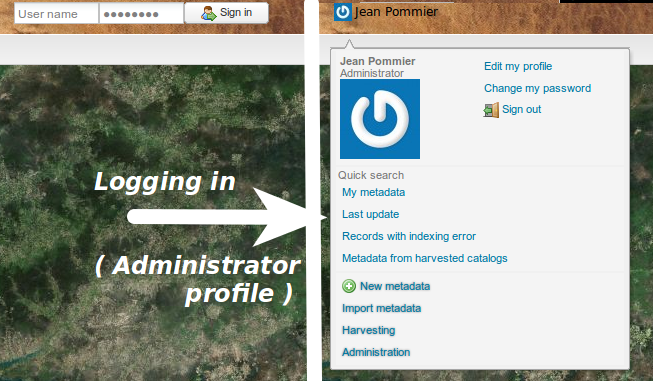

.. include:: ../substitutions.txt

.. _user_profiles:

User profiles
=============

In the following chapters, we will call user someone registered, with any credential level (editor, administrator, etc)

Credentials are dealt with separately for each server application: a user that is expected to manage both |gn| and |gs| content must 
be registered both in |gn| *and* |gs|. His login and passwords will not necessarily be identical.

.. _gn_user_profiles:

User profiles in |gn|
---------------------

.. figure:: usersHierarchy.png
   :scale: 50 %
   :align: right

   User profiles inheritance
   
There are several profile levels:

- **Plain user**, unregistered, cannot log in. He has only access to what is described in the `User Manual <http://gm-risk.pigeo.fr/docs/userdoc/html/index.html>`_.

- **Registered User** has access to some restricted metadata and data.

- **Editor** has some limited rights: can create some metadata but not make them public (must be validated by higher rank), mostly.

- **Reviewer** is same than Editor, except he can make metadata public

- **Users Administrator** is some kind of moderator over some groups of people.

- **Administrator** has all rights.


.. note:: It is not necessary to have people at each level. As a first start, one or two Administrators and several Reviewers may be fine. Then as people get in,
   they should start as Editor (they will be harmless) and when they prove trustworthy, be promoted to Reviewer.

   If the scale grows larger, it may become interesting to dispatch the moderating functions over each  involved Organization: give each Organization a Users Administrator 
   that will be able to manage his own people.

   It is not advised to multiply the number of Administrators, since as they have all rights, everything could quickly get complicated.
 
.. _login: 
 
Logging in
``````````


   Logging in the portal

To log in the portal, enter your username and password in the login form, in the  top-right corner and press *Sign in*.

If your credentials are correct, the form will be replaced by your name. Place the mouse over the name, it will open a menu. The *Administration* entry will lead to the 
main administration page. Most of the other entries are some shortcuts to some menus in the administration page.

.. note:: being logged in will also have other effects, depending on your user profile: it will add some entries in several menus, add some fields in the advanced 
   search form and even add some available layers in the layertree (*Select* tab)
 
 
.. _gs_user_profiles:
 
User profiles in |gs|
---------------------

The Users management in |gs| is much more open. See Geoserver Documentation, section `Security <http://docs.geoserver.org/2.5.x/en/user/security/index.html>`_.

.. note:: Having a profile in |gs| is only needed for those who want to create new layers for the layertree. 