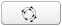

.. include:: ../substitutions.txt
.. |dashboard| image:: dashboard.png
.. |qmark| image:: windows_qmark.png
.. |anim| image:: animation.png
.. |fb| image:: fb.png
   :scale: 75 %
.. |b| image:: b.png
   :scale: 75 %
.. |pb| image:: pb.png
   :scale: 75 %
.. |pause| image:: pause.png
   :scale: 75 %

.. |f| image:: f.png
   :scale: 75 %
.. |ff| image:: ff.png
   :scale: 75 %
.. |pquery| image:: ../map/polygon_query_16px.png

.. _advanced_tools:

Advanced tools
==============

.. index:: pair: Polygon Query; Control

.. _polygon_query: 

|pquery| Polygon Query
----------------------

Presentation
````````````
The standard :ref:`query<query_layers>` tool only allows to perform punctual queries. While this satisfies many needs, 
there are some cases when you want to collect some information on a surface rather than on punctual locations. Say, for example, you need to know how 
many people live in a given area at risk. Or, you want to know the lowest, or the highest elevation in this area. You will not do this using punctual 
queries. You will use this new polygonal queries tool.

This tool will be available for only specific layers. You basicly have to select one of those layers, draw on the map the polygon defining the area you want to 
query, and get the results.

Identify suitable layers
````````````````````````

This is done in the Organize tab (left panel): suitable layers have the |pquery| icon (see :ref:`layers_icons`).

Selecting a suitable layer (mouse-click on it) should enable the |pquery| *Polygon Query* button on the map's top toolbar.

Use the Polygon Query tool
``````````````````````````

.. figure:: pquery_usage.png

   Using the Polygon Query tool.


Click on the |pquery| *Polygon Query* button on the map's top toolbar, it will switch the mouse to *Polygon Query* mode and 
open a window on the left, with some informational text but no data yet.

Then draw a polygon on the map: each mouse-click will add a corner ; a double click will close the polygon and trigger the query.

This then may take a while, for the server to compute and return the data. The data is then displayed on the bottom part of the window.

Draw again a new polygon, close-it by double-click and the result will update accordingly.

To quit the *Polygon Query* mode, switch back to another tool in the map's top toolbar, say the *Pan* mode, for example.

.. _animations: 

.. index:: pair: Animation; Control

|anim| Animations
-----------------

Some data are meaningful only if one can browse them in their temporal dimension. The Temporal Profiles tool gives one way of exploring these data. 
Another way is to play animations. Like it is usually done with cloud weather data.

A “player” has been implemented for such use : the animations tool.

Each dataset that can be used with this tool is configured by an Administrator. The portal User can select the dataset to animate, load it, 
and play the animation, either backward or forward, or step-by-step.

Activate Animations tool
````````````````````````

One can activate the tool by clicking the |anim| *Animation* button in the map's top toolbar.

.. figure:: animations_open.png

   Open the Animations tool, select the dataset to animate.

A window pops up. You first have to choose the dataset you want to animate and then load it (click on the Load button).

A progress bar will keep you informed on the loading status: all data have to be loaded before you can start playing the animation. This allows for 
more fluidity afterwards. 

If you load the dataset for the first time, it may take some sime. Afterwards, it should be quite straightforward, since the data are cached in the browser.

When the dataset has finished loading, the second half of the window gets accessible: the player part, composed of:

- A slider, telling you where you are on the dataset. It starts on the last image (for meteo data, the current meteo).

- A field telling you the date associated with this image.

- A row of buttons for animation control.

You can play the animation, either by moving the slider, or using the animation control buttons.

.. figure:: animations_play.png

   Data is loaded, the animation layer is added in the Organize layers list.

Animation control buttons
`````````````````````````

This is a 7 buttons row:

- |fb| moves to the first (oldest) image. If an animation is running, it will move to the first image, but will not stop the animation (for this, use the pause button).

- |b| moves to the previous image.

- |pb| backward animation button: loops over the images, playing backward. The animation will keep playing until you press the pause button (or the forward 
  animation button, which will revert the play).

- |pause| pause button: this will stop any animations in play.

- |pf| forward animation button: loops over the images, playing forward. The animation will keep playing until you press the pause button (or the backward animation button, 
  which will revert the play).

- |f| moves to the next image.

- |ff| moves to the last (the more recent) image. If an animation is running, it will move to the last image, but will not stop the animation (for this, use the pause button).

Animation map layer
```````````````````

When you start playing the images, a new layer is added in the Organize tab, with the dataset's name. You can use it as any other map layer : play on opacity, 
curtain settings, visibility,reorganize with other layers, etc.

If you close the animation window, the layer is kept visible. This allows you to use it without having to keep this window around. If you want to remove the layer, 
simply unckeck it, or remove it (right-click, choose remove).

.. note:: Be aware that if you close the window while an animation is playing, it will keep playing. To stop it from playing, open the animation tool again, and press the 
   pause button.

.. _temporal_profiles: 


.. index:: Temporal Profile, NDVI, Soil Moisture, VCI, graphics


|dashboard| Temporal profiles
-----------------------------

This tool is activated by clicking the |dashboard| *Temporal Profile* button, on the map's top toolbar.


.. figure:: ndvi.png
   :scale: 50 %
   :align: right

   NDVI index, annual data graphic

The form of the mouse cursor changes to a |qmark| question mark. Click a place on the map where you want to get some profiling information. It will open a window.

The window has several tabs, one per dataset:

- `NDVI <http://en.wikipedia.org/wiki/Normalized_Difference_Vegetation_Index>`_ (Normalized Difference Vegetation Index)

- Soil Moisture indicator

- VCI (Vegetation Condition Index)

For each of these layers, two kind of profiles are available:

- Annual data: select a year, press *Apply* and the data are recovered, one value by decade (each 10 days) and displayed as a graphic.

- History of a decade: select a decade (month then day of the month), press *Apply* and the history of the values taken by the index over the years is displayed as a graphic.


