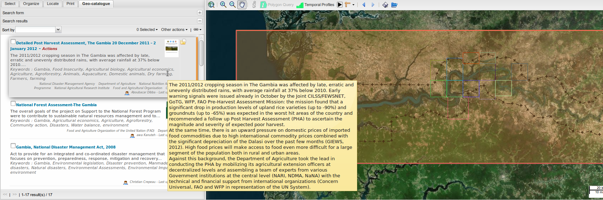
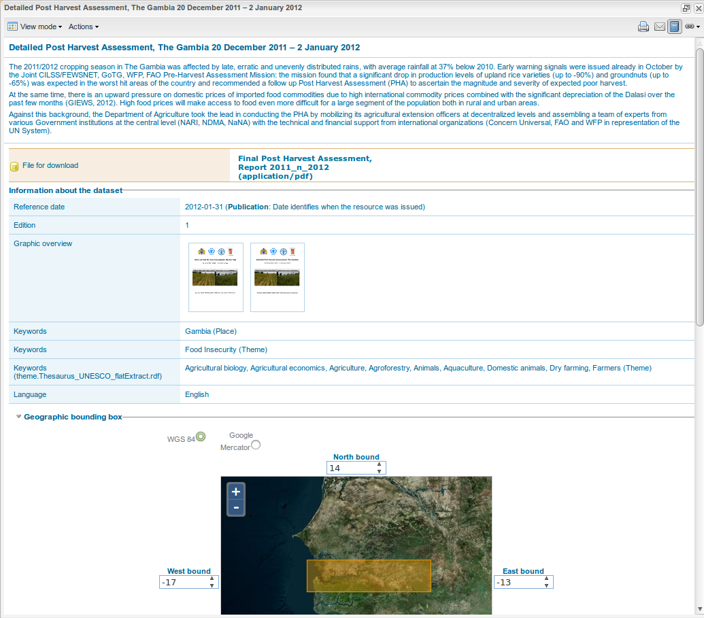

.. include:: ../substitutions.txt


.. index:: Geo-catalog, Search, Metadata


.. _geocatalog:

Geo-catalog
===========

This is the search engine for the |project|. It allows you to perform searches in the cataloged data. 
It is possible that, for a while, the number of referenced documents stay limited, and so will be the usefulness of the catalog. But as the time goes, 
an increasing amount of data will be stored in the catalog, making the catalog's search engine the only way to fully harnest its content.

Search form
-----------

.. figure:: searchform.png
   :scale: 50 %
   :align: right

   Search form, with advanced 
   options unfolded
   
The form in the *Geo-catalog* tab gives wide means to query the catalog, depending on relevant fields in the metadata sheets. Each search field
defines a specific search criteria, that gets combined with the others. 

**The first form field**, with no label, **is a free search field**, and
corresponds to the usual search field of a search engine, like Google's, for example. The words entered in that field are looked for in the
whole content of the metadata sheets. Each sheet containing one of the word is selected as belonging to the search results.

This is just a beginning: you can add more search criteria:

- **Resource type**: most data are classified in Datasets. Data series correspond to
  series, like, for example, the whole set of topographic 1/250 000th scale maps. The Service (Web Map Services) and Feature catalog are more
  rare and reserved to experts. 

- **Geographic criteria**: one of the ideas of geocatalogs is, precisely, to take into account the geographic
  positioning of objects. Therefore, we can deal with those information, while searching for data. 

  *  *Select extent*: by clicking on this button, you can draw on the map an extent box for the search. By default, all data intersecting 
     this box, even partially, will be selected. This behavior can be changed with the Relation type list. 
     
     If not satisfied with the drawn box, you can redraw it as much as you want. You can
     remove the box by clicking the remove button. 
     
     To disable the Select extent button, you can click on the hand button in the map toolbar: it
     is attached to the same buttons toggle-group. 
       
  * *Relation type*: it allows you to define the kind of relation assumed for the box. The most interesting are: 
  
     - Overlaps: default choice. All the data whose extent  overlaps, even partially, the box are selected. 
     
     - Encloses: all the data whose extent contain the box are selected. 
     
     - Fully Outside of : the data outside of the box are selected. 
     
     - Within: selects the data whose extent is strictly within the box. 

.. figure:: advanced_search.png
   :scale: 50 %

   Advanced search using both geographic extent definition and some advanced options

- **Advanced search options**: this field set allows you to set more criteria, more precise. Be careful that by defining too much criteria, 
  you may end with no result... 
  
  + *Keywords*: we can enter some keywords. Those keywords are only looked for in the words set as keywords in the sheets, not in the whole 
    content (use free search field for this). If clicking on the arrow on the right of the field, a list of available keywords is proposed. 
    Auto-completion is also available. 
     
  + *Organization*: you can restrict the search based on which organization owns the metadata.

  + *Category*: GeoNetwork gives the possibility to attach given categories to the metadata. This is a complementary approach to the keywords use. 
    You can restrict the search to certain of these categories. 

  + *When?*: by default, this fields set is folded, thus invisible. You can unfold it by clicking on the arrow on the left. It is used to restrict 
    the search on temporal criteria: 
     
     * Metadata change date: you can, for example, select all the data that have not been updated since at least 5 years. Or, on the contrary, 
       data published less than 1 month ago. 
     
     * Temporal extent: same thing, but on the data date itself, as defined in the metadata sheet. 
     
     * The fields can be reset by clicking the “any time” check-box. 

  + Spatial representation: allows to filter on the data type: raster data, text, vector, video, etc. 
  
  + Scale: when checked, a cursor allows you to set the scale extent to apply. 
     
  + *Catalog*: the geocatalog can perform what is called “harvesting”. It can harvest other catalogs, for example the FAO geocatalog, that can 
    contain relevant data for our purpose. Those harvested catalogs are also queried in the search. Using this field, you can choose to restrict 
    the search to one or more catalogs. 
  
- **Options**: allows you to define display and sorting parameters for the search results' display. 

Finally (but you don't have to fill all the field !), you trigger the search by clicking on the Search button.


Results
-------

After searching in the catalog database, the Search Form folds itself and gives place to the Results panel. This panel lists the
search results, 10 by 10. 




   Search results list. Hovering a result with the mouse opens a tip showing the full abstract. In the map, the rectangles represent 
   the extent of each result, one color per result. The highlighted one is the current hovered result.


Results list
````````````

Each result element shows : 

- A checkbox to select the result (you can perform actions on selected metadata using the top toolbar's Other actions menu) 

- The title. You click it to open the full metadata sheet. 

- The summary, truncated if too large. 

- The keywords list. 

- A thumbnail (if available). Click it to open the large thumbnail. 

- An icon list on the right, telling you the additional feature of this data: 

  * data to download; 
  
  * geospatial data to display in the map; 
  
  * web links. 
  
  Those icons are not clickable, but just give you the information. To go further, you have to pass by the complete metadata sheet 
  (click on the title). 
  
- On the right border, a colored line tells you what color is used for the extent, as drawn on the map. This way you can visually identify the result's extent on
  the map. When hovering a result, its extent is made brighter.

- On the bottom right, the referent organism is shown, if available. 

- When hovering the result for a while, a “tooltip” is shown. It contains the whole summary. 

- Finally, double-clicking on the result entry positions the map on its extent.




   A metadata sheet


Toolbars
--------

Top toolbar
```````````

The top toolbar allows you to: 

- Sort the results based on a different criteria.

- Select/unselect results.

- Perform actions on selected results. For simple visitors, the available actions are mostly limited to exporting data in several formats. If logged in,
  other actions are available, such as edition, duplicate metadata, set privileges, etc. 

Bottom toolbar
``````````````

 It gives you control over the results' pagination. 
