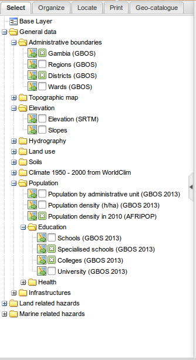

.. _introduction:
.. include:: ../substitutions.txt

Geoportal's layout
==================

In order to leave the largest area possible to the map area, the other elements have been grouped whenever possible. 
The layout is then cut in only three parts, one of them almost negligible: 

- The header

- A central panel with the map

- A left panel giving access to lots of functionnalities

.. figure:: layout.png

   Global layout

.. _header_panel:

Header panel
------------

.. figure:: header.png

   Header panel
   
The header panel is the simplest part. It contains:

- The site's name

- The :index:`login form`, for registered users and administrators

- The language switcher: the site is available in English and French

- The :index:`help` link: gives access to some helpful links, including this documentation.

.. _central_panel:

Central panel: Interactive map
------------------------------

.. figure:: map.png
   :scale: 50 %
   :align: right

   Central panel: the map
   
The central panel contains the map and most of its tools: toolbar on the top, scale and coordinates widget on the bottom-right corner.

The map itself is interactive, meaning you can move the center of the map, zoom in or out, add some overlays, etc.

In default mode, you are in 'pan' mode: if you keep pressed the left button of your mouse and move the mouse, you will move the map. 
The pan mode is activated with the *hand* button in the map's toolbar.

You can zoom in or out, either by using the mouse's wheel, or by selecting one of the zoom buttons, just left of the *hand* button in the toolbar.
Using the zoom in button (the one with the '+'), you can draw a rectangle defining the area on which you want to zoom. 

Returning to the initial point of view is done using the *Full extent* button (the first button on the left).

Returning to the previous zoom (and back to the next)  can be done using the *history* buttons, the blue arrow buttons.

You can even perform more advanced actions, which will be detailed on :ref:`advanced_tools`.

.. note:: A tooltip is available for each button on the map's toolbar: it will show if you leave the mouse over the button for a while. 

.. _left_panel:

Left panel: the control center
------------------------------

   Left panel
   
The left panel is composed of several tabs:

- *Select* tab is a hierarchical list of cartographic overlays (layers). Checking a layer will add it to the map. After checking the layers to display, it will be necessary to order them properly, add some transparency, etc. This happens in the next tab:
 
- *Organize* tab is merely empty at the beginning. It gets filled as one checks some layers, in the *Select* tab.  The checked layers are added in the 'Overlays' folder. It is the place to reorganize them, manage them, consult them.

- *Locate* tab regroups some positionning tools: zoom by administrative areas, searching for a place in an external placenames database.

- *Print* tab is the printing configuration panel.

- *Geo-catalogue* tab is the form to search for data, in the metadata database. This is the 'library' database search area.

   
