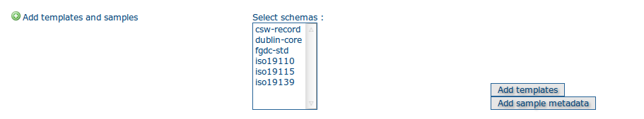

.. include:: ../../substitutions.txt

.. _samplemetadata:

Load sample metadata
====================

From the home page, identify yourself using the default administrator name and password: admin/admin.

Go to the admin page, select the metadata standards you wish to use, and then run the buttons *Add templates* and *Add sample metadata*:

   Add metadata templates and samples
