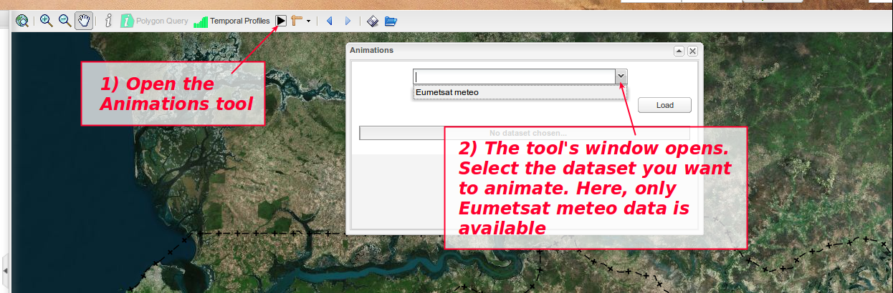

.. include:: ../substitutions.txt
.. |dashboard| image:: dashboard.png
.. |qmark| image:: windows_qmark.png
.. |anim| image:: animation.png
.. |fb| image:: fb.png
   :scale: 75 %
.. |b| image:: b.png
   :scale: 75 %
.. |pb| image:: pb.png
   :scale: 75 %
.. |pause| image:: pause.png
   :scale: 75 %
.. |pf| image:: pf.png
   :scale: 75 %
.. |f| image:: f.png
   :scale: 75 %
.. |ff| image:: ff.png
   :scale: 75 %
.. |pquery| image:: polygon_query_16px.png

.. _advanced_tools2:

Outils d'interrogation avancés, 2e partie
=========================================

Interrogation Polygonale
------------------------

Présentation
~~~~~~~~~~~~

L'outil d'interrogation avancée, de même que l'outil d'interrogation de base, ne permettent d'effectuer que des requêtes ponctuelles. Bien que cela suffise à un grand
nombre des besoins, il peut arriver que vous vouliez collecter des informations sur une surface plutôt que sur des emplacements ponctuels. Disons, par exemple, que vous
vouliez savoir combien de personnes vivent dans un secteur à risque donné.
Ou, que vous vouliez déterminer l'élévation la plus basse, ou la plus haute, sur un secteur donné. Vous ne pourrez pas réaliser cela avec les outils d'interrogation 
ponctuels. Vous utiliserez plutôt ce nouvel outil d'interrogation polygonale.
 
Cet outil n'est disponible que pour certains calques bien spécifiques. Pour ces calques, il suffira de sélectionner le calque, activer l'outil, dessiner le polygone 
sur la carte et vous obtiendrez les résultats.

|1000000000000777000002EE40EB3623_png|

Activer l'outil
~~~~~~~~~~~~~~~

Depuis l'onglet *Organiser* (panneau de gauche), sélectionnez un calque supportant l'interrogation polygonale (voir illsutration ci-dessus). Le bouton dans la barre
d'outils sera activé. Cliquer alors sur le bouton puis dessiner votre polygone.

Limitations
~~~~~~~~~~~

L'outil d'interrogation polygonale n'est disponible que pour certaines couches bien spécifiques. Celles-ci doivent remplir les critères suivants : 

* Etre des couches **raster**.

* Etre servies par un serveur cartographique supportant le protocole WPS (*Web Processing Services*). Pour plus d'informations à ce sujet, voir 
  les *Considérations techniques*.

* Etre convenablement configurées dans le gestionnaire du |lt|. (voir *Configuration*).

Fonctionnalités
~~~~~~~~~~~~~~~

Collecter des statistiques
^^^^^^^^^^^^^^^^^^^^^^^^^^

L'outil d'interrogation polygonale collecte des statistiques sur une bande pré-configurée d'une donnée raster. Les statistiques disponibles sont : 

* Nombre de pixels compris dans le polygone (pixels de la donnée raster source).

* Somme totale des valeurs des pixels (par ex. pour une donnée de population, population totale comptabilisée sur cette surface).

* Valeur min.

* Valeur maxi.

* Valeur moyenne.

* Ecart-type.

Il est possible, dans la configuration, de choisir de masquer certains de ces résultats. Par exemple, le champ Somme n'aura aucun sens si l'on a affaire à une donnée
d'élévation (relief).

Valeurs arrondies
^^^^^^^^^^^^^^^^^

Les valeurs sont calculées avec une grande précision. Cela s'avère souvent non-pertinent : il est donc possible de définir le niveau d'arrondi 
des valeurs (nombre de décimales).

Définir l'entête
^^^^^^^^^^^^^^^^

.. figure:: at10.png
   :scale: 50 %
   :align: right

   Entête personnalisé.

.. figure:: at9.png
   :scale: 50 %
   :align: right

   Affichage standard des résultats.

L'affichage standard des résultats est assez simple : un entête, suivi d'une liste de paires nom/valeur pour chaque statistique affichée.

Un entête par défaut est fourni ("Statistiques collectées"), mais vous pouvez définir votre propre entête dans la configuration.

Si seulement une seule statistique est retenue, le nom de la statistque n'aura guère d'intérêt (il sera possible de faire mieux en personnalisant l'entête)
et ne sera pas affiché, supposant que vous utiliserez l'entête personnalisé pour obtenir l'affichage voulu.

Configuration
~~~~~~~~~~~~~

La configuration se fait dans le Gestionnaire du |lt|, en bas du formulaire dédié aux couches WMS (cet outil n'est pas disponible pour les données *charts*).

|1000000000000700000002BF55217514_png|

Une case à cocher "Activer l'Interrogation Polygonale?" est décochée par défaut. Si vous voulez activer l'outil d'interrogation polygonale, vous devrez : 

* cocher cette case.

* Définir le nom de couche à interroger. Ce n'est pas nécessairement le même nom que celui de la couche WMS. Par exemple, pour une donnée d'élévation, 
  la couche WMS pourrait être une combinaison de l'élévation et d'effets d'ombrage. Mais vous voudrez collecter les statistiques sur la donnée brute d'élévation. 
  Dans ce cas, la couche WMS pourrait s'appeler  *bi:bi_srtmhill* mais pour l'interrogation polygonale, vous prendrez la couche de référence *bi:bi_SRTM*.

  Si le nom de couche reste vide, l'outil restera désactivé pour cette couche, dans l'interface publique.

* Définir le numéro de bande. Informe le système de la bande sur laquelle effectuer la collecte de stats. Par défaut, vaut 0. Dans le cas d'un raster mono-bande, 
  ce sera le bon choix. Sinon, il se peut que vous vouliez collecter les stats sur une autre bande que la première. *Utiliser le numéro de bande* (pas son nom).

* Définir l'entête si vous voulez qu'il soit personnalisé. Sinon, par défaut, il affichera "Statistiques collectées".

* Choisir les stats à afficher. Comme dit précédemment, certaines valeurs peuvent n'avoir aucun sens, selon le type de donnée traitée.

* Choisir le niveau d'arrondi (nombre de décimales conservées après la virgule).
  Vaut 0 par défaut, i.e. valeurs arrondies à l'entier le plus proche.

* Appliquer la configuration pour cette couche (cliquer sur le bouton *Appliquer*).

* Sauver la configuration de l'arborescence (menu Arborescence → Sauver vers la BD. Voir la documentation du Gestionnaire du |lt| pour plus d'information).

Considérations techniques
~~~~~~~~~~~~~~~~~~~~~~~~~

WPS
^^^

Pour pouvoir utiliser l'outil d'interrogation polygonale sur une couche, la protocole WPS
(*Web Processing Services*) doit être disponible pour cette couche.

Cela se configure du côté du serveur cartographique. L'instance de GeoServer utilisée par défaut pour le géoportail support le protocole WPS. Des serveurs externes ne 
le supporteront pas forcément.

WPS permet d'exécuter des traitements avancés sur une couche carto. Un de ces traitements permet d'extraire des statistiques à partir d'un jeu de données raster, 
à partir d'une emprise polygonale. C'est ce traitement que nous utilisons pour cet outil. Dans GeoServer, le service correspondant s'appelle ras:RasterZonalStatistics (
`http://pigeo.fr/geoserver-prod/web/?wicket:bookmarkablePage=:org.geoserver.wps.web.WPSRequestBuilder <http://pigeo.fr/geoserver-prod/web/?wicket:bookmarkablePage=:org.geoserver.wps.web.WPSRequestBuilder>`_
).

Les traitements WPS disponibles peuvent être listés via la commande GetCapabilities (http://pigeo.fr/geoserver-prod/ows?service=wps&version=1.0.0&request=GetCapabilities)

Résolution de problèmes
~~~~~~~~~~~~~~~~~~~~~~~

Quand je dessine le polygone sur la carte, comme est-ce que je le ferme ?
^^^^^^^^^^^^^^^^^^^^^^^^^^^^^^^^^^^^^^^^^^^^^^^^^^^^^^^^^^^^^^^^^^^^^^^^^

Le polygone se ferme d'un double-clic. Attention à ne pas bouger la souris durant le double-clic.

La fenêtre de l'outil d'interrogation polygonale cache la liste des calques cartographiques
^^^^^^^^^^^^^^^^^^^^^^^^^^^^^^^^^^^^^^^^^^^^^^^^^^^^^^^^^^^^^^^^^^^^^^^^^^^^^^^^^^^^^^^^^^^

Oui, par défaut, la fenêtre se positionne par-dessus le panneau latéral, de sorte à dégager l'espace cartographique. Mais vous pouvez la déplacer
à votre guise. Vous pouvez même la fermer : elle s'ouvrira de nouveau lorsque des informations seront mises à jour (nouvelle interrogation).

J'obtiens une erreur à la récupération des statistiques
^^^^^^^^^^^^^^^^^^^^^^^^^^^^^^^^^^^^^^^^^^^^^^^^^^^^^^^
Erreur "Une erreur est survenue lors de la récupération des statistiques. Il est possible que cela
soit dû à une instabilité de votre connexion internet. Si le problème persiste, merci de contacter l'administrateur
du géoportail."

Si au lieu des résultats vous obtenez ce message, il est fort probable que la couche n'a pas été convenablement configurée.

J'obtiens des statistiques bizarres / valeurs négatives là où ça ne devrait pas
^^^^^^^^^^^^^^^^^^^^^^^^^^^^^^^^^^^^^^^^^^^^^^^^^^^^^^^^^^^^^^^^^^^^^^^^^^^^^^^

Il est probable que vous ayez des problèmes avec les valeurs Nodata de cette couche : les emplacements où il n'y a pas de données peuvent être codés de façons
différentes d'un raster à un autre. Certains vont placer des valeurs négatives extrêmes pour symboliser l'absence de données. C'est par exemple le cas de la donnée
AFRIPOP, qui code son Nodata avec la valeur -9999. Donc si votre requête inclut des pixels ayant la valeur Nodata, dans ce type de cas, cela va fausser
complètement vos résultats.

Un moyen de contourner ce problème se passe du côté de la préparation des données avant la publication : changer les valeurs Nodata à 0 plutôt qu'à -9999 par e

.. |10000000000000420000002008059F76_png| image:: images/10000000000000420000002008059F76.png
    :width: 1.134cm
    :height: 0.55cm

.. |100000000000073F00000217376DCE46_png| image:: images/100000000000073F00000217376DCE46.png
    :width: 17.6cm
    :height: 5.075cm

.. |10000000000000470000001E15B90C19_png| image:: images/10000000000000470000001E15B90C19.png
    :width: 1.131cm
    :height: 0.478cm

.. |1000000000000048000000214C6C849F_png| image:: images/1000000000000048000000214C6C849F.png
    :width: 1.154cm
    :height: 0.529cm

.. |10000000000000460000001E4AF278FA_png| image:: images/10000000000000460000001E4AF278FA.png
    :width: 1.154cm
    :height: 0.496cm

.. |10000000000000470000001D7DCB0A45_png| image:: images/10000000000000470000001D7DCB0A45.png
    :width: 1.154cm
    :height: 0.471cm

.. |1000000000000777000002EE40EB3623_png| image:: images/1000000000000777000002EE40EB3623.png
    :width: 17.6cm
    :height: 6.907cm

.. |1000000000000700000002BF55217514_png| image:: images/1000000000000700000002BF55217514.png
    :width: 17.6cm
    :height: 6.904cm
    