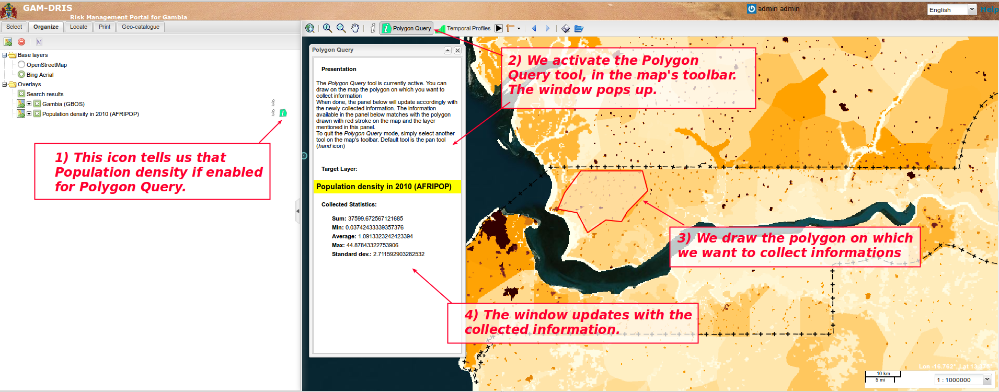

.. include:: ../substitutions.txt
.. |dashboard| image:: dashboard.png
.. |qmark| image:: windows_qmark.png
.. |anim| image:: animation.png
.. |fb| image:: fb.png
   :scale: 75 %

.. |pause| image:: pause.png
   :scale: 75 %
.. |pf| image:: pf.png
   :scale: 75 %
.. |f| image:: f.png
   :scale: 75 %
.. |ff| image:: ff.png
   :scale: 75 %
.. |pquery| image:: polygon_query_16px.png

.. _advanced_tools_anim:
    
Outil Animations
================

Certaines données prennent tout leur sens lorsque l'on peut les explorer dans leur dimension temporelle. L'outil des profils temporels est un moyen d'explorer de telles 
données. Une autre façon de procéder consiste à jouer les images sous forme d'animations, comme c'est couramment fait pour des données de type image satellites météo.

Un "lecteur" a été développé pour répondre à ce type de besoins : l'outil Animations.

Un administrateur configure un jeu de données pour cet outil. L'utilisateur simple peut sélectionner cet outil, le charger, jouer l'animation, en avant ou en arrière,
ou bien étape-par-étape.

Interface publique
------------------

Pour activer l'outil, il suffit de cliquer sur le bouton |anim| *Animations* de la barre d'outils de la carte

.. figure:: animations_open.png

   Ouvrir l'outil *Animations*. Sélectionner la donnée à animer.

Une fenêtre s'ouvre. Vous devez d'abord choisir la donnée à animer, puis la charger (cliquer sur le bouton "Charger").

Une barre d'avancement vous tiendra informé de la progression du chargement : toutes les données se chargent avant de pouvoir jouer l'animation. 
Cela permet d'obtenir une meilleur fluidité par la suite.

Si vous chargez le jeu de données pour la première fois, cela prendra peut-être un peu de temps. Ensuite, cela devrait être rapide, les données étant 
conservées en cache dans le navigateur.

Quand le jeu de données est complètement chargé, la partie basse de la fenêtre devient accessible : la partie "lecteur", composée de :

- Un curseur, vous informant de la position au sein du jeu de données. Au départ, il se positionne sur la dernière image.

- Un champ texte précisant la date associée à cette image.

- Une rangée de boutons de contrôle de l'animation.

Vous pouvez jouer l'animation soit en déplaçant le curseur, ou bien en utilisant les boutons de contrôle.

.. figure:: animations_play.png

   Les données sont chargées, le calque d'animation est ajouté dans la liste des calques de l'onglet *Organiser*.

Boutons de contrôle de l'animation
~~~~~~~~~~~~~~~~~~~~~~~~~~~~~~~~~~

Il y a 7 boutons : 

- |fb| passe à la première (plus vieille) image. Si une animation est en cours, l'animation ne sera pas stoppée (pour ça, utiliser le bouton pause), 
  mais juste recalée sur la première image.

- |b| passe à l'image précédente

- |pb| bouton d'animation rétrograde : boucle sur les images, en jouant "vers l'arrière". L'animation continuera de jouer tant que vous ne presserez pas le bouton Pause 
  (ou le bouton d'animation "en avant", qui inversa l'animation).

- |pause| bouton pause : cela stoppera toute animation en cours.

- |pf| bouton d'animation "en avant": boucle sur les images, vers l'avant. L'animation continuera de jouer tant que vous ne presserez pas le bouton Pause 
  (ou le bouton d'animation rétrograde, qui inversa l'animation).

- |f| passe à l'image suivante.

- |ff| passe à la dernière image (la plus récente).  Si une animation est en cours, l'animation ne sera pas stoppée (pour ça, utiliser le bouton pause), 
  mais juste recalée sur la dernière image.

Calque associé à l'outil Animations
~~~~~~~~~~~~~~~~~~~~~~~~~~~~~~~~~~~

Lorsque vous commencez à jouer les images, un nouveau calque est ajouté dans l'onglet *Organiser*, nommé du nom du jeu de données animé. Vous pouvez l'utiliser comme n'importe 
quel autre calque de la carte : changer son opacité, le réorganiser par rapport aux autres calque, etc.

Si vous fermez la fenêtre Animations, le calque reste présent dans l'onglet *Organiser* et visible sur la carte. Cela vous permet de le visualiser sans formcément conserver 
la fenêtre quelque part. Si vous voulez supprimer le calque, décochez-le ou supprimez-le (clic-droit, choisir "supprimer").

.. note:: Attention, si vous fermez la fenêtre alors qu'une boucle d'animation est en cours, celle-ci continuera de jouer. Pour l'arrêter, ouvrez la fenêtre Animations à 
   nouveau (cliquer sur le bouton *Animations* de la barre d'outils) et cliquez sur le bouton *pause*).

Configuration
-------------

Configurer une nouvelle animation n'arrive pas très souvent, donc la configuration a été conservée au niveau du serveur et nécessite de recharger le géoportail.
Deux fichiers sont concernés : config-pigeo.xml et config-pigeo-animations.xml ; les deux sont situés dans le dossier WEB-INF de la webapp du geoportail.

**Pour appliquer les réglages, vous devrez recharger la webapp ; il s'agit donc d'une tâche affectée à l'administrateur système.**

config-pigeo.xml
~~~~~~~~~~~~~~~~

C'est là que se trouve la configuration générale des services d'animation.
**Normalement, ça ne se définit qu'initialement, à la mise en place du géoportail, et n'a pas besoin d'être retouché ultérieurement, à moins d'avoir de bonnes raisons
de le faire (réorganisation des dossiers de stockage)**.

C'est ici que vous allez définir le chemin de base pour les données d'animation (veuillez noter que ce chemin de référence sera commun à toutes les données d'animations) 
et l'extension des fichiers (habituellement, ce sera des PNGs).

Chercher la section des services Animations. Les deux services à configurer s'appellent
``pigeo.animations.listfiles``

et
``pigeo.animations.listfiles.json``

Le paramètre *ext* n'a probablement pas besoin d'être changé : vous utiliserez probablement des fichiers PNG, puisque sinon vous n'auriez pas de transparence.

   .. code-block:: xml
   
      <!-- - - - - - - - - - - - - - - - - - - - - - - - - - - - - - - - -->
        <!-- Animation services                                           -->
        <!-- - - - - - - - - - - - - - - - - - - - - - - - - - - - - - - - -->
      <service name="pigeo.animations.listfiles">
         <class name="fr.pigeosolutions.geoportal.services.animations.ListFiles">
            <param name="basePath" value="geoportal/animations/"/>
            <param name="ext" value="png"/>
         </class>
      </service>
      <service name="pigeo.animations.listfiles.json">
         <class name="fr.pigeosolutions.geoportal.services.animations.ListFiles">
            <param name="basePath" value="geoportal/animations/"/>
            <param name="ext" value="png"/>
         </class>
         <output sheet="pigeo/geoportal/tojson.xsl" contentType="application/json; 
         charset=UTF-8"/>
      </service>
      <service name="pigeo.animations.getimage">
         <class name="fr.pigeosolutions.geoportal.services.animations.GetImage" />
         <error id="file-not-found" sheet="error-embedded.xsl" statusCode="404">
            <xml name="error" file="xml/file-not-found-error.xml" />
         </error>

         <output file="true" />
      </service>
      
      
      <service name="pigeo.animations.list">
         <output sheet="pigeo/geoportal/listAnimations.xsl" contentType="text/xml; 
         charset=UTF-8">
            <xml name="animations" file="WEB-INF/config-pigeo-animations.xml" 
            localized="false" />
         </output>
      </service>
      
*La configuration des services Animation dans config-pigeo.xml*
   

Définir le paramètre basePath
^^^^^^^^^^^^^^^^^^^^^^^^^^^^^

Le paramètre basePath nécessitera peut-être d'être changé pour le faire correspondre au modèle de données du serveur hôte.

C'est l'emplacement de base où les dossiers des images à utiliser pour les animations seront placés.

Il peut s'agir soit d'un chemin relatif, soit d'un chemin absolu :

* ``<param name="basePath" value="geoportal/animations/"/>``  sera relatif à votre répertoire de données |gn|.
  Supposons que votre répertoire de données |gn| soir ``~/tomcat7/data/gm-risk-gn2_10-datadir``, le basePath pointera alors vers
  ``~/tomcat7/data/gm-risk-gn2_10-datadir/geoportal/animations/``, signifiant que vous placerez les dossiers des jeux de données dans ce répertoire.

* ``<param name="basePath" value="/home/large/geoportal/animations/"/>`` par contre commence par un */*, il s'agit donc d'un chemin absolu.

config-pigeo-animations.xml
~~~~~~~~~~~~~~~~~~~~~~~~~~~

C'est là que vous déclarerez les jeux de données qui seront mis à disposition pour l'outil Animations.

Pour ajouter un nouveau jeu de données, vous devrez ajouter un nouveau bloc <dataset>. Le meilleur moyen consiste à en copier un existant et ajuster les valeurs.

Voici les balises XML à remplir :

<id>
^^^^

C'est le nom du dossier, tel que vous le trouverez dans le dossier déterminé par la variable basePath (voir config-pigeo.xml). S'ils ne correspondent pas, l'outil
ne trouvera pas le jeu de données. Il est conseillé d'utiliser des noms de fichiers système, simple (i.e. alphanumériques), sans caractères spéciaux ni espaces.

label
^^^^^

C'est le nom tel qu'il sera affiché dans la liste des jeux de données disponibles, dans la fenêtre de l'outil Animations. Il sera aussi utilisé pour nommer le calque
qui sera ajouté dans l'onglet *Organiser*, lorsque l'outil est activé. N'importe quelle chaine de caractère est autorisée. Vous pouvez utiliser des espaces !

SRS
^^^

Précise le système de projection utilisé pour la définition de l'emprise (voir ci-dessous).

geographicbounds
^^^^^^^^^^^^^^^^

Comme notre jeu de données est une liste de fichiers PNG simples, il est nécessaire de spécifier où le géoportail doit positionner les images, sur la carte.
Cela se fait via la déclaration d'un rectangle d'emprise : limites nord, sud, est et ouest.

Un bon moyen d'obtenir cette emprise, si vous générez les PNGs à partir d'une donnée géospatiale, consiste à utiliser l'outil gdalinfo 
(voir `GDAL <http://gdal.org/>`_ pour obtenir l'emprise. Soyez bien vigilant à définir correctement la balise SRS pour cette emprise.

imagesize
^^^^^^^^^

Taille de l'image, en pixels.

timestampformatter
^^^^^^^^^^^^^^^^^^

Cette balise est un peu délicate à utiliser. Elle permet d'extraire la *date*  (dans la fenêtre de l'outil Animations) à partir des noms de fichiers.
Supposons que vos fichiers soient nommés suivant le modèle ``mpe_141121_0432.png``, les 6 premiers nombres étant la date et les 4 derniers l'heure.
Vous voudriez un affichage plus clair de la date, quelque chose du genre ``2014-11-21 T 04:32``.

Cette transformation s'obtiendra en utilisant le *timestampformatter*. C'est une expression javascript : n'importe quelle expression javascript devrait marcher.
Pour l'essentiel, tout se jouera avec des fonctions de traitement de textes. Dans le cas de notre exemple : 

   .. code-block:: xml
   
      <timestampformatter>
        "20"+filename.substr(4,2)+"-"+filename.substr(6,2)+"-"+filename.substr(8,2)
        +" T "+filename.substr(11,2)+":"+filename.substr(13,2)
      </timestampformatter>
   
fera l'affaire.

   .. code-block:: xml
   
      <?xml version="1.0" encoding="UTF-8"?>
      <!-- 
       Define here parameters specific for animations application 
       (weather animations)
       <timestampformatter> : javascript function that builds the 
       time stamp out of the file name (use variable 'filename')
       example :   filename          mpe_140917-1402.png
                   timestampformatter  "20"+filename.substr(4,2)+"-"
                        +filename.substr(6,2)+"-"+filename.substr(8,2)
                        +" T "+filename.substr(11,2)+":"+filename.substr(13,2)
         gives timestamp      2014-09-17 T 14:02                              
      -->
      <animations>
       <!-- List of the available DBs (connection must be properly defined in 
       config-override-dev/prod.xml -->
       <datasets>
         <dataset>
            <id>eumetsat</id> <!-- must match the data folder name-->
            <label>Eumetsat meteo</label>
            <SRS>EPSG:4326</SRS>
            <geographicbounds>
               <minlon>-30.0093561</minlon>
               <minlat>-35.0062377</minlat>
               <maxlon>54.9937605</maxlon>
               <maxlat>36.0168419</maxlat>
            </geographicbounds>
            <imagesize>
               <width>1514</width>
               <height>1265</height>
            </imagesize>
            <timestampformatter>
            "20"+filename.substr(4,2)+"-"+filename.substr(6,2)+"-"
            +filename.substr(8,2)+" T "+filename.substr(11,2)+":"+filename.substr(13,2)
            </timestampformatter>
         </dataset>
       </datasets>
      </animations>

*Le fichier de configuration config-pigeo-animations.xml. Une seule donnée est configurée, pour l'instant.*
      
      
Etendue temporelle de l'animation
~~~~~~~~~~~~~~~~~~~~~~~~~~~~~~~~~

L'étendue temporelle de l'animation est facile à définir : l'outil utilise toutes les données présentes dans le dossier.
L'étendue est donc définie en externe, dans les scripts qui vont générer les images et les placer dans le dossier. En supprimant les vieilles images en même 
temps que vous ajoutez les nouvelles, vous conservez une étendue temporelle fixe. De cette façon, tout est possible y compris des configurations compliquées.

Considérations techniques
-------------------------

Optimisation de l'usage de bande passante
~~~~~~~~~~~~~~~~~~~~~~~~~~~~~~~~~~~~~~~~~

Cet outil a été développé avec cette préoccupation en premier plan : 

* en utilisant des images dédiées, optimisées en termes de taille et de poids, cela minimise le chargement initial.

* En utilisant le cache du navigateur : lorsqu'elles sont déjà été chargées, les images sont conservées dans le cache et réutilisées. Vous ne devriez pas 
  avoir à charger deux fois la même image, à moins d'avoir vidé le cache du navigateur entre les deux. Le prochain chargement, donc, devrait être très rapide.

.. |10000000000000420000002008059F76_png| image:: images/10000000000000420000002008059F76.png
    :width: 1.134cm
    :height: 0.55cm

.. |100000000000073F00000217376DCE46_png| image:: images/100000000000073F00000217376DCE46.png
    :width: 17.6cm
    :height: 5.075cm

.. |10000000000000470000001E15B90C19_png| image:: images/10000000000000470000001E15B90C19.png
    :width: 1.131cm
    :height: 0.478cm

.. |10000000000000420000001A30DF0EBB_png| image:: images/10000000000000420000001A30DF0EBB.png
    :width: 1.196cm
    :height: 0.471cm

.. |1000000000000048000000214C6C849F_png| image:: images/1000000000000048000000214C6C849F.png
    :width: 1.154cm
    :height: 0.529cm

.. |10000000000000460000001ECE99DE80_png| image:: images/10000000000000460000001ECE99DE80.png
    :width: 1.189cm
    :height: 0.51cm

.. |10000000000000460000001E4AF278FA_png| image:: images/10000000000000460000001E4AF278FA.png
    :width: 1.154cm
    :height: 0.496cm

.. |10000000000004DE0000019AF1DFF19F_png| image:: images/10000000000004DE0000019AF1DFF19F.png
    :width: 15.365cm
    :height: 5.055cm

.. |10000000000000470000001D7DCB0A45_png| image:: images/10000000000000470000001D7DCB0A45.png
    :width: 1.154cm
    :height: 0.471cm

.. |1000000000000700000002BF55217514_png| image:: images/1000000000000700000002BF55217514.png
    :width: 17.6cm
    :height: 6.904cm
    