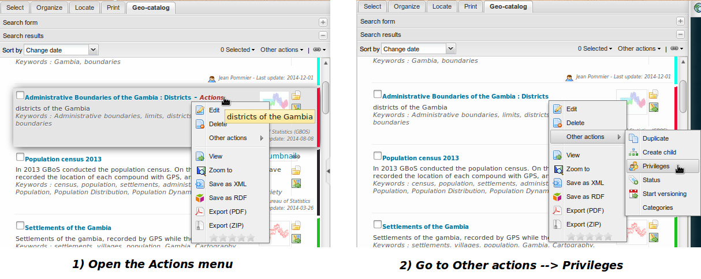
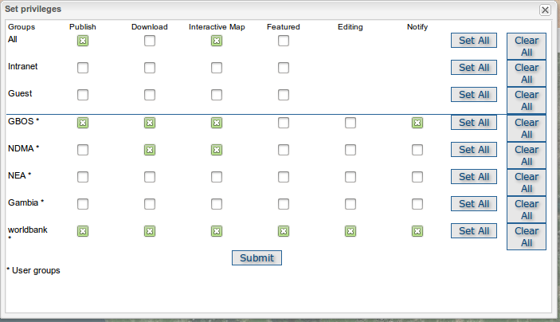

.. include:: ../substitutions.txt

.. _metadata_workflow:

Métadonnées
===========

Pour une introduction sur les métadonnées, veuillez lire  
`Viewing and Analysing the Data <http://geonetwork-opensource.org/manuals/2.10.4/eng/users/quickstartguide/viewing/index.html>`_ 
dans la  documentation |gn|.

Editer une métadonnée existante
-------------------------------

Pour pouvoir éditer une métadonnée, vous devez disposer des droits suffisants. Ce qui signifie que vous devez vous être connecté (voir :ref:`login`), et être 

- soit son propriétaire (voir :ref:`ownership`)

- soit avoir un profil *Relecteur* ou *Administrateur d'utilisateurs* sur le groupe auquel appartient la métadonnée

- soit être *Administrateur*.

.. figure:: edit.png
   :scale: 50 %
   :align: right

   Ouvrir une métadonnée en mode Edition

En général, on voudra éditer une métadonnée existante parce que certaines informations manquent ou sont incorrectes.
Ce qui signifie que vous savez déjà comment accéder à la fiche de métadonnée, soit en passant par une recherche dans le géocatalogue, soit en demandant la métadonnée associée
à un calque cartographique (onglet *Organiser*).

Dans la fiche de métadonnée, dans la barre d'outils du haut, il y a un menu *Actions*. Si vous êtes connecté et avez des droits d'édition sur cette métadonnée, la première action proposée 
dans ce menu devrait être *Editer*.
Cliquer dessus, cela ouvrira la métadonnée dans son formulaire d'édition.

L'édition proprement dite se passe comme lors de l'édition d'une nouvelle métadonnée, sauf que les champs sont déjà remplis (au moins certains d'entre eux).

Créer une nouvelle métadonnée
-----------------------------

.. figure:: new.png

   Créer une nouvelle métadonnée
 
Pour créer une nouvelle métadonnée, il faut tout d'abord être connecté (voir :ref:`login`), avec un profil *Editeur* ou supérieur.

#. Ouvrez votre menu personnel (survolez votre nom d'utilisateur en haut à droite avec la souris), et choisissez dans le menu l'entrée *Nouvelle métadonnée*. Cliquez dessus.

   Cela ouvrira une fenêtre intitulée "Créer une métadonnée en choisissant un modèle et un groupe".
  
#. Dans cette fenêtre, sélectionner le modèle à partir duquel la métadonnée sera créée.

#. Puis en bas *de cette même fenêtre*, n'oubliez pas de choisir le groupe auquel appartiendra la métadonnée.

#. Enfin, cliquez sur *Créer*. Ca ouvrira la fiche de la nouvelle métadonnée en mode *Edition*.

Puis, pour l'édition, voir `la section correspondante <http://geonetwork-opensource.org/manuals/2.10.4/eng/users/quickstartguide/new_metadata/index.html>`_ dans la 
documentation |gn|.

Publier une métadonnée
----------------------

Une fois la métadonnée créée, elle sera disponible dans le catalogue, mais seulement pour les personnes du groupe auquel appartient la métadonnée (voir ci-dessus).

Pour la rendre pleinement accessible, vous devez changer les privilèges associés à cette métadonnée, c'est à dire les droits d'accès qui lui sont affectés.

   Ouvrir la fenêtre de gestion des privilèges

Un utilisateur avec le profil *Editeur* sera limité dans ses actions. Un *Relecteur* ou au-dessus aura tout contrôle sur la table des privilèges.

Le meilleur moyen de localiser la métadonnée nouvellement créée consiste à ouvrir son menu personnel et cliquer sur l'entrée *Dernières mises à jour*. Cela réalise une recherche 
parmi vos métadonnées, listées par date de mise à jour, donc votre nouvelle métadonnée devrait être la première listée.
   
En laissant la souris survoler le titre, un menu *Action* devrait apparaître à côté. Cliquer sur *Action* pour ouvrir le menu, puis aller dans 
:menuselection:`Autres actions --> Privileges`. Cela ouvrira la table des privilèges. 

   Gérer les privileges
   
Ci-dessous se trouve une brève description des privilèges, afin de vous aider à identifier lequels assigner à quel(s) groupe(s).

**Publier**: Les utilisateurs du groupe spécifié peuvent voir la métadonnée (menu contextuel d'un calque depuis l'onglet *Organiser*, recherche dans le géocatalogue).

**Télécharger**: Les utilisateurs du groupe spécifié peuvent télécharger la donnée associée à la fiche, s'il y en a.

**Carte interactive**: Les utilisateurs du groupe spécifié peuvent afficher les données cartographiques associées (s'il y en a) dans la carte du géoportail.

**Epinglée**: *Pas utilisé dans l'interface du Geoportail*.

**Notifier**: Les utilisateurs du groupe spécifié recoivent une notification si une donnée attachée à la métadonnée est téléchargée.

Utiliser les modèles
--------------------

Pour une description des modèles tels qu'ils sont définis dans |gn|, veuillez vous référer à
`Templates <http://geonetwork-opensource.org/manuals/2.10.4/eng/users/managing_metadata/templates/index.html>`_.

Les modèles peuvent être très utiles pour gagner du temps lors de la création de multiples métadonnées semblables entre elles : créer un modèle contenant tout le contenu commun aux 
métadonnées considérées (points de contact, étendue, mots-clefs communs, etc) puis utiliser ce modèle comme base pour la création des métadonnées.

Créer un modèle est aussi simple que créer une métadonnée : vous procédez comme pour une nouvelle métadonnée, choisissez un modèle d'origine, un groupe, passez en mode édition, 
éditez le contenu pis, dans le coin en haut à gauche, cliquez sur le bouton *Type d'enregistrement* et sélectionnez *Modèle* au lieu de *Métadonnée*. Sauvez. Fermez. 
C'est fait, votre nouveau modèle est créé. Définissez les privilèges en fonction de l'usage que vous voulez en faire (juste pour vous, partager avec le groupe, etc).

En fait, les modèles sont juste des métadonnées spéciales, invisibles lors d'une recherche standard pour des métadonnées.

.. note:: un champ des critères avancés, dans la recherche, permet de demander à lister les modèles. C'est un très bon moyen pour ouvrir en modification un modèle existant, ou vérifier son 
   contenu !

