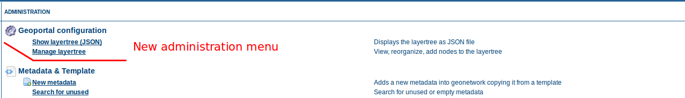
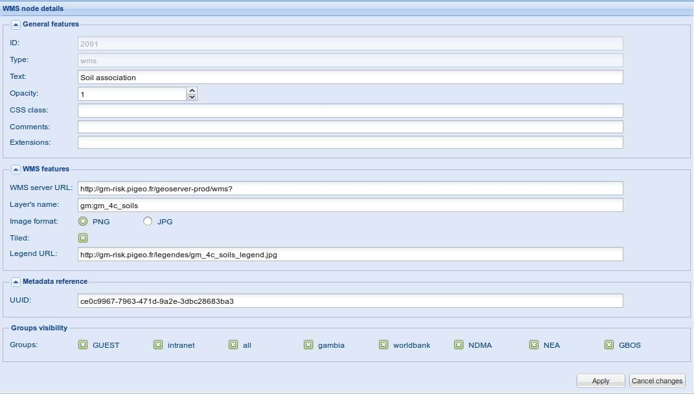
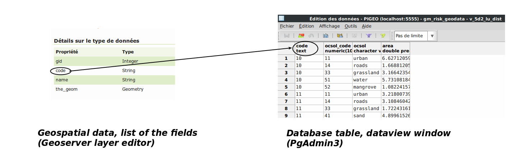
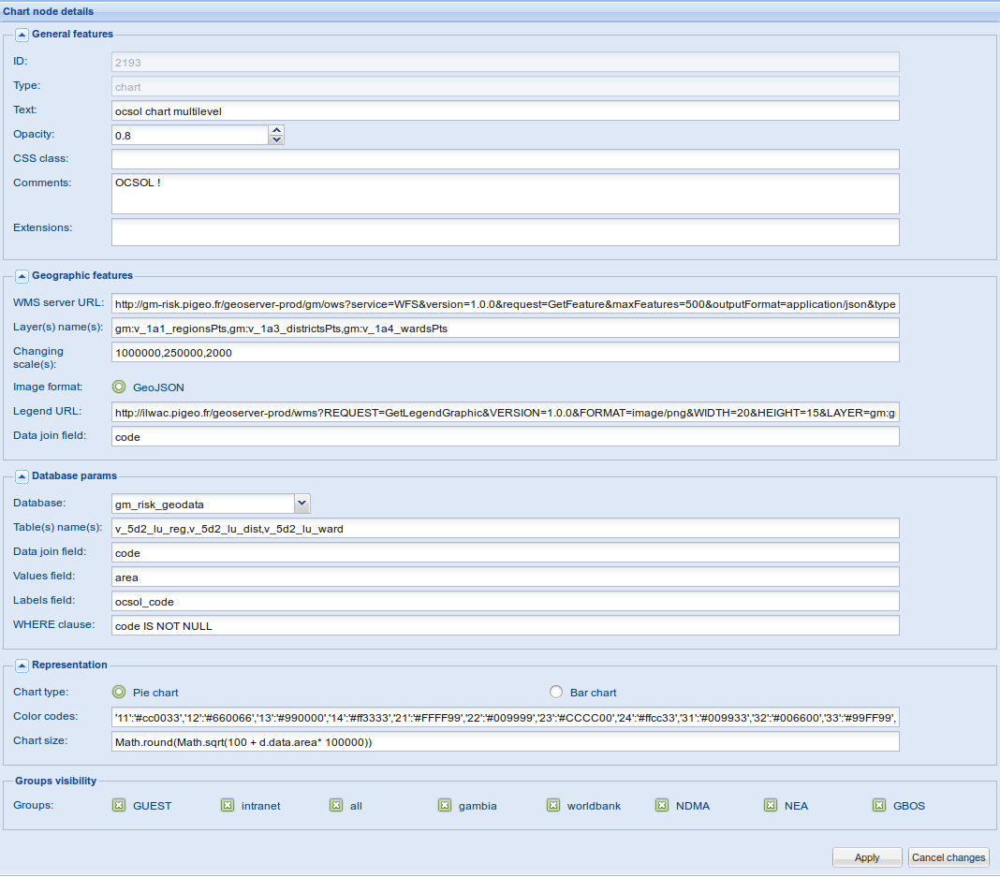

.. include:: ../substitutions.txt
.. |lt| replace:: Référentiel de données Géospatiales


.. _layertree:

Gestion du |lt|
===============

.. note:: la gestion du |lt| est réservée aux personnes ayant un profil *Administrateur*.

Ce que nous appellerons ici |lt| est la structure arborescente présente dans l'onglet *Sélectionner*, dans l'interface publique du Géoportail.
Il sert à organiser les calques cartographiques de façon hiérarchique, tout comme le sont les fichiers sur votre ordinateur, placés dans une hiérarchie de dossiers. 

Cette structure est stockée dans une base de données.

Elle est administrée à partir d'une interface graphique.

Elle permet de définir la visibilité des calques  en fonction des groupes d'appartenance, tout comme pour les privilèges des métadonnées. Cela vous permet de pleinement gérer 
l'accès aux données en fonction des groupes auxquels appartiennent les utilisateurs.

Accéder à l'Interface Graphique d'administration
------------------------------------------------

L'interface graphique est accessible depuis la page principale d'administration. Son accès n'est donné qu'aux profils *Administrateur*.




   Ouvrir la page d'administration du |lt|.
   
Un nouveau menu a été ajouté dans la page principale d'administration : *Configuration du Géoportail*. Il reprendra toutes les tâches d'administration qui 
seront développées dans le contexte du Géoportail. Pour l'instant, il ne contient que ce qui est relatif à la gestion du |lt|.

*Gérer le |lt|* n'apparaîtra que si vous êtes bien connecté en tant qu'*Administrateur*.


.. figure:: lt-layout.png

   La page d'administration du |lt|
   
La page qui s'ouvrira alors est composée de 4 espaces : 

- un menu en haut à gauche

- la structure arborescente à gauche

- un panneau vide (pour l'instant) à droite

- un panneau "console" en bas.

Menu
````

Le menu liste presque toutes les actions que vous pouvez réaliser sur la structure arborescente : Sauver/restaurer/exporter l'arborescence, Ajouter, Supprimer ou dupliquer
un calque/dossier. Ces actions seront décrites plus loin dans cette page.

Arborescence
````````````

La structure est exactement la même que ce qui est disponibles dans l'interface publique. Un dossier ouvert dans cette page donnera un dossier ouvert
dans l'interface publique. Un dossier fermé donnera un dossier fermé. Un calque coché sera coché dans l'interface publique ( i.e. visible).

Panneau de droite
`````````````````

C'est là que le panneau d'édition sera placé. Son contenu dépendr de l'action en cours. Nous expliquerons chaque cas de figure ci-dessous.

Console
```````

La console affiche des informations à propos des actions réalisées. Garder un oeil sur la console vous permettra de vous assurer que tout se passe comme prévu.

Conventions
```````````

Dans les chapitres suivants, nous appellerons 'noeud' tout élément de l'arborescence, que ce soit un calque ou un dossier.

Editer un noeud
---------------

C'est le plus facile. Cliquez sur le noeud, dans l'arbre. Un formulaire va s'afficher dans le panneau de droite, listant les attributs du noeud.

Les deux premiers champs du formulaire sont grisés, ce qui signifie que vous ne pouvez pas les modifier. Ils sont là à titre purement informatif.

Quelques champs (pas beaucoup) sont communs à toutes types de noeuds. La plupart sont spécifiques à chaque type de noeud.

En bas du formulaire, deux boutons vous permettent soit d'annuler les changements (réinitialise le formulaire aux valeurs précédentes), soit de les appliquer (applique les 
changements au |lt|). **Si vous n'appliquez pas les changements, ils ne seront pas conservés, lorsque vous changez de noeud**.

Champs communs
``````````````
- **ID** : identifiant unique attribué au noeud. Non-éditable (utilisé en interne dans la base de données et le code).

- **Type** : type de noeud. Prend une des valeurs suivantes : folder, wms, chart. Non-éditable (défini automatiquement).

- **Text** : le nom qui sera affiché dans l'arborescence.

- **Classe CSS** : 
   prévu pour une extension aisée du stylage. Pour l'instant, seules deux valeurs sont disponibles : ``important`` (écrit le nom en gras) et ``grey`` (grise le nom).
   Ajouter de nouvelles classes est facile pour qui sait écrire du code CSS : il suffit d'éditer le fichier apps/geoportal/css/gnjp.css et d'ajouter des entrées sous la forme suivante :form: 
   ``.x-tree-node .important {font-weight:bold;}``
   où vous remplacerez  ``.important`` par le nom de classe que vous voudrez ajouter, et le contenu entre accolades par le style CSS.
   
- **Extensions** : Prévu pour faciliter des extensions ultérieures. Pour l'instant, laisser vide.

- **Visibilité selon les groupes** :
   liste tous les groupes disponibles (tels que définis dans l'interface d'administration  de |gn|. Voir :ref:`user_management`.
      
   Par défaut, tous les groupes sont cochés, ce qui signifie que le noeud est visible pour tous. Décocher certains des groupes permettra de restreindre la visibilité du
   noeud aux seuls groupes cochés.
      
Noeuds de type dossier ("folder")
`````````````````````````````````


.. figure:: 1000000000000431000001320D9BF018.png
   :scale: 50 %
   :align: right

   Le formulaire pour un noeud de type Dossier
   
Les noeuds de type dossier n'ont pas de champ supplémentaire : ils sont juste là pour organiser les noeuds calques.

.. note:: L'état replié/déplié des dossier est aussi stocké. L'état est directement pris dans l'arborescence, et sauvé lorsqu'on sauvegarde les changements dans la 
   base de données. Ne pas l'oublier au moment de la sauvegarde !
   
*Noeud dossier spécifique* : le premier noeud de l'arbre, "fond cartographique", est en fait un noeud dossier, malgré son icône différente. Ne le supprimez pas, ne le déplacez pas ! 
Il abritera automatiquement les couches de fond de carte (Bing, Open Street Map, etc).

Noeuds WMS
``````````




   Noeud WMS
   
Un noeud WMS possède plusieurs champs supplémentaires : 

**[Bloc Paramètres généraux]**

- **Opacité** : Opacité du calque. Entre 0 et 1 (1 est totalement opaque, 0 est totalement transparent). Vaut 1 par défaut.

- **Commentaires** : vous pouvez saisir ici du texte, qui sera affiché lorsque la souris survole le nom de la couche, depuis l'interface publique.

**[Bloc Paramètres WMS]**

- **URL sur serveur WMS** : le nom est explicite. Le contenu dépendra du serveur cartographique (GeoServer, MapServer, etc) utilisé pour cette couche et de son emplacement.
  Par défaut : ``http://bi-risk.pigeo.fr/geoserver-prod/wms?``
  
- **Nom(s) des(s) couche(s)** : saisir ici le nom de la couche, telle que définie dans le serveur carto. Une liste de noms de couches devrait marcher également, donnant
  comme résultat une combinaison des couches listées.
  
- **Format d'image** : PNG par défaut. En général le bon choix. Vous pouvez aussi choisir JPG, mais attention ! vous n'aurez pas la transparence.
 
- **Tuilé** :  coché par défaut. Vous pouvez le décocher pour les données que vous ne voulez pas stocker en cache (données temps réel qui vont changer fréquemment).

- **URL de la Legende** :  si ce champ est vide, le géoportail utilisera la légende fournie par défaut par le serveur cartographique.
  Utilisez ce champ si vous voulez paramétrer la légende de façon spécifique, ou pour fournir un lien vers une légende externe, pré-générée. La valeur ici doit être une URL valide.
   
**[Bloc Référence métadonnée]**

- **UUID**: entrer ici l'uuid (*Unique Universal Identifier*) de la fiche de métadonnée à associer. Cela reliera la métadonnée |gn| au noeud.


Noeuds graphiques (*charts*)
````````````````````````````

La section *Paramètres généraux* est similaire aux noeuds WMS. le reste est nettement plus conséquent.

Un noeud graphique est une représentation très particulière des données. Elle nécessite de bien connaître le modèle des données sous-jacentes. 
Le procédé combine une ou plusieurs couches WFS au format GeoJSON (pour l'aspect donnée géospatiale) avec des tables d'une base de données, contenant les données à joindre.

Pour les personnes habituées aux bases de données, il s'agit de réaliser une jointure entre une donnée géospatiale et sa table correspondante. Sauf qu'on peut le faire sur plusieurs 
niveaux de représentation (échelle).
Les couches WFS GeoJSON et les tables de la base de donnée sont reliées par paires. Plusieurs couches GeoJSON (et leurs tables correspondantes) peuvent être utilisées pour
définir différentes représentations en fonction de l'échelle de la carte. Par exemple, selon les niveaux administratifs : région, province, communes, etc.
Il est aussi bien sûr possible de n'utiliser qu'un niveau de représentation : dans ce cas, vous ne définirez qu'une seule couche GeoJSON, et une seule table de données.

Préparer les données
********************




   Préparer les données : collecter les informations

Pour réaliser une jointure entre une couche GeoJSON et une table de base de données, les deux ont besoin d'un identifiant commun, sur lequel réaliser la jointure. Le nom de l'identifiant
n'a pas besoin d'être le même, bien que cela aide à reconnaître la relation entre la donnée géospatiale et la donnée tabulaire associée.

Comme montré dans la figure ci-dessus (example d'une donnée d'occupation du sol), pour un identifiant de jointure donné, la table de la base de données va retourner 
plusieurs ligne : 1 ligne par valeur que vous voudez représenter dans le graphique.

Tous les champs présents dans la donnée géospatiale et dans la table associée seront disponibles pour la définition de la taille des graphiques (voir ci-dessous).

Attention ! Soyez prudent dans le nommage des champs (champs de la donnée géospatiale ET de la base de données) : évitez les espaces, caractères spéciaux, caractères accentués.
Sont totalement supportés : caractères alphanumériques, "_", "-". Les autres caractères ne sont pas conseillés, ni garantis.
 
.. note:: Dans le formulaire décrit ci-dessous, attention également à ne pas laisser traîner des espaces ou guillemets non désirés. Cela pourrait corrompre le fonctionnement...

Le formulaire pour les noeuds graphiques (*charts*)
***************************************************




   Le formulaire pour les noeuds graphiques
   
**[Bloc Paramètres généraux]**

- **Opacité** : Opacité du calque. Entre 0 et 1 (1 est totalement opaque, 0 est totalement transparent). Vaut 1 par défaut.

- **Commentaires** : vous pouvez saisir ici du texte, qui sera affiché lorsque la souris survole le nom de la couche, depuis l'interface publique.

**[Eléments géographiques] : rassemble les champs relatifs aux jeux de données géospatiales GeoJSON**

- **URL du serveur WFS** : C'est une URL standard pour requêter du GeoJSON en WFS, sauf que le paramètre *typeName* est placé à la fin et n'est pas défini (la valeur sera 
  celle définie dans le champ suivant). La valeur par défaut est 
  ``http://bi-risk.pigeo.fr/geoserver-prod/bi/ows?service=WFS%26version=1.0.0%26request=GetFeature%26maxFeatures=500%26outputFormat=application/json%26typeName=``
   
- **Nom(s) des(s) couche(s)** : le nom de la couche GeoJSON. Si vous voulez une représentation multi-échelle, ce sera une liste de noms séparés par une virgule. Pas d'espace dans la liste. 
  Attention, l'ordre est important, dans la liste : de la donnée de plus large dimension à la plus petite.
   
- **Echelle(s) seuil** : une liste de valeurs séparées par une virgule (ne pas laisser d'espace). Même cardinalité que pour les noms de couches. Cela définit l'échelle minimum jusqu'à laquelle
  la couche correspondante est visible.

- **Format de la donnée** : pour une couche de type chart, une seule valeur est acceptée : GeoJSON.

- **URL de la légende** : par défaut, il n'y a pas de légende pour les couches de type chart. Si vous voulez afficher une légende, il faudra donc la générer à la main, 
  et donner l'URL ici.
  
- **Champ de jointure de données** : le nom du champ utilisé, du côté de la donnée géospatiale, pour réaliser la jointure. Doit être visible dans l'éditeur de couches carto de |gs| 
  (première page de l'éditeur) et orthographiée exactement pareil.
   
**[Paramètres de la base de données] : rassemble les champs relatifs à base de données**

- **Base de données** : liste déroulante des bases de données disponibles. Une base doit être configurée dans le système (voir plus loin) pour être affichée dans cette liste.

- **Nom(s) de(s) table(s)** : une liste de noms de tables (ou vues) à utiliser, dans le même ordre que les données géospatiales. Liste de noms séparés par une virgule. Pas d'espaces. 
  **Même cardinalité que la liste des couches géospatiales**. 

  **Le droit en lecture doit être accordé, pour les tables de la base de données, soit à l'utilisateur ``geonetwork``r** (l'utilisateur défini dans la configuration des bases de données),
  **ou en accès ``Public``**.
   
- **Champ de jointure de données** : le nom du champ utilisé pour la jointure, du côté de la base de données..

- **Champ contenant les valeurs** : le nom du champ qui sera utilisé pour le dimensionnement des éléments graphiques (quartiers pour un graphique de type camemberts, hauteur des barre pour 
  un histogramme). Doit être une donnée numérique.

- **Champ contenant les étiquettes** : le nom du champ qui servira pour définir le schéma de couleurs (voir *Codes couleur* ci-dessous).

- **clause WHERE (facultatif)** : permet d'introduire un filtre sélectif dans la requête SQL. Par exemple pour éliminer toutes les lignes vides. C'est un moreceau de pur code SQL, 
  comme vous l'écririez dans une requête SQL normale. Elle peut même inclure des noms de champs (de la table) qui ne sont pas listés dans les champs précédent du formulaire.

**[Représentation]**

- **Type de graphique** :au choix, Camemberts ou Barres (histogramme). Camemberts par défaut.

- **Codes de couleur** : une liste, séparée par des virgules, de paires clef:valeur. Les clefs sont prises parmi les entrées du champ défini pour *Champ contenant les étiquettes*
  et les valeurs sont des couleurs en notation hexadécimale comme en HTML (#RRGGBB). Tant les clefs que les valeurs doivent être entre guillemets simples (').
  Dans le cas où il n'est pas défini, ou incorrect, des couleurs aléatoires seront utilisées.
  Exemple de liste : ``'11':'#cc0033','12':'#660066','13':'#990000','14':'#ff3333','21':'#FFFF99','22':'#009999',``
  ``'23':'#CCCC00','24':'#ffcc33'``
   
- **Taille des graphiques** : en pixels. N'importe quelle expression pouvant être traitée en javascript devrait marcher.
  L'expression la plus simple est une valeur numérique, par exemple ``30``. Une expression plus compliquée, par exemple, pourrait être  
  ``Math.round(Math.sqrt(100 + d.data.area* 100000))``. Voir 
  `javascript built-in Math functions <https://developer.mozilla.org/en-US/docs/Web/JavaScript/Reference/Global_Objects/Math>`_.
  
  Vous pouvez accéder aux données àa la fois de la donnée géospatiale et de la base de données : 
  
    - pour accéder aux données de la donnée géospatiale, utiliser la variable *geo*
    
    - pour accéder aux données de la base, utiliser la variable *d.data*
    
    *Exemple : avec le schema d'occupation du sol illustré précédemment, on peut utiliser la valeur du champ *areaù en utilisant ``d.data.area``. Les valeurs du
    champ *ocsol* seront obtenues avec ``d.data.ocsol``.
    Et les noms, dans la donnée géospatiale, seront accessibles avec ``geo.name``.*
      
**[Référence métadonnée]**

- **UUID** : vous pouvez saisir ici l'identifiant UUID  (*Unique Universal Identifier*) de la fiche de métadonnée correspondante. 
  Cela relie la métadonnée créée sous |gn| avec le noeud.
  
Lorsque vous avez fini d'éditer le noeud, vous pouvez cliquer sur *Appliquer*. Si vous ne le faites pas, les changements ne seront pas conservés !

.. warning:: *Appliquer* applique les changement à l'arborescence à gauche, mais ne sauve pas les changements durablement sur la base de données. Il faudra, pour cela,
   exécuter la commande *Arborescence -> Sauver (vers la BD)* dans le menu en haut à gauche.


Ajouter, déplacer, supprimer un noeud
-------------------------------------

Ajouter un noeud
````````````````

.. figure:: 10000000000001C8000000B99700B7D1.png
   :scale: 50 %
   :align: right

   Ajouter un noeud

Pour ajouter un noeud, sélectionnez tout d'abord l'emplacement où vous voulez qu'il soit placé. Vous pouvez sélectionner soit un dossier (qui contiendra le noeud), soit une
couche qui se situe dans le même dossier que celui où vous voulez placer le noeud

Ensuite, dans la barre de menu, cliquez sur *Ajouter* et choisissez le type de noeud que vous voulez créer.

Puis, finalement, éditez les paramètres du noeud nouvellement créé, dans le panneau de droite, et faites *Appliquer*.

Dupliquer un noeud
``````````````````

C'est une autre façon de créer un noeud : vous dupliquez le noeud actuelllement sélectionné, puis changez les paramètres. Cette procédure peut s'avérer plus rapide quand
vous avez affaire à un ensemble de noeuds très proches.
Si nécessaire, après duplication, vous pouvez même déplacer le nouveau noeud dans un autre dossier.

Supprimer un noeud
``````````````````

La fonction est explicite : elle permet de supprimer le noeud actuellement sélectionné. Une fenêtre de confirmation vous demandera de confirmer que vous voulez bien 
supprimer ce  noeud.

Déplacer un noeud (réorganisez la structure arborescente
````````````````````````````````````````````````````````

!la réorganisation de la structure se fait par drag'n'drop : cliquez sur un noeud, gardez la souris pressée et déplacez le noeud vers son nouvel emplacement.

Sachez que vous pouvez vous entrainer sans risque tant que vous ne faites pas *Arborescence -> Sauver (vers la BD)*: il vous suffira de *Recharger* l'arborescence.
Et même alors, vous avez toujours la possibilité de restaurer l'arbre à un état précédent (voir *Restaurer*).


Sauver et restaurer l'arborescence
----------------------------------

Après avoir vu comment modifier l'abre (ajouter des noeuds, en supprimer, les modifier, les déplacer), il est temps de voir comment enregistrer ces changements. 
Ou les annuler.

Dans ma barre de menu, la première entrée s'occupe des entrées/sorties pour l'arborescence : sauver vers la base, recharger, exporter, importer, gestion des backups.

.. figure:: 1000000000000205000000FA376A1F25.png
   :scale: 50 %
   :align: right

   Sauver l'arbre (vers la base)
   
Sauvegarder
```````````

Il suffit de cliquer sur *Sauver (vers la BD)*.
On vous demandera de donner un nom à la sauvegarde : cela servira pour la gestion des backups, pour identifier cette version de l'arbre.
Il est conseillé d'utiliser des noms explicites de sorte à pouvoir facilement vous y retrouver.

Vérifiez dans la console : si quelque chose se passe mal, elle devrait vous en informer. 

Recharger l'arbre
`````````````````

Imaginons que vous avez supprimé accidentellement un noeud. Tant que vous n'avez rien sauvé dans la BD, vous pouvez toujours réinitialiser l'arbre en le rechargeant 
(depuis la BD).

Exporter (JSON)
```````````````

Cela va exporter l'arbre, dans sa version actuelle, dans le format de donnée JSON (sorte de javascript). Vous pouvez alors le copier, le sauver dans un fichier, 
le visualiser dans un éditeur de texte, etc.

Cela peut vous servir de backup de l'arbre, en complément de celui qui est intégré dans le système.

C'est aussi une façon de récupérer des fragments d'un arbre sur un portail afin de les insérer dans un autre portail.

Importer (JSON)
```````````````

C'est la fonction réciproque de l'export en JSON : cela vous permet de remplacer l'arbre actuel par le contenu d'une donnée JSON 
(par exemple un export JSON à une autre date). Il suffit de coller le contenu JSON dans le formulaire proposé.

Restaurer une version antérieure
````````````````````````````````

.. figure:: 1000000000000382000000AE64CCC60D.png
   :scale: 50 %
   :align: right

   Restaurer une version antérieure
   
… pourrait aussi s'appeler 'Gestion des sauvegardes', puisque cela permet plus que simplement restaurer depuis une version précédente.

Une table dans la base de données sur géoportail est dédiée au stockage de l'historique des sauvegardes générées automatiquement à chaque fois que vous 
faites *Sauver (vers la BD)*. Ainsi, si quelque chose part de travers, vous pouvez toujours revenir en arrière.

Cela ouvrira un  tableau dans le panneau de droite. Les sauvegardes sont listées par ordre chronologique. Sélectionnez une colonne, et vous pouvez la supprimer, 
l'afficher (au format JSON, le même qu'avec l'export) ou le restaurer. Restaurer remplacera l'arbre actuel par les données contenues dans la sauvegarde. Il faudra encore 
faire *Sauver (vers la BD)* si vous voulez appliquer durablement les changements dans la base de données.

Gestion des groupes
```````````````````

Nous avons vu que pour chaque noeud, vous pouvez définir quels groupes pourront le voir. Une personne appartient souvent à plusieurs groupes.
Si un de ses groupes a accès à un noeud, alors cette personne y aura accès, quelle que soit la situation pour les autres groupes auxquels elle appartient.


.. figure:: 10000000000003810000009A62661B53.png
   :scale: 50 %
   :align: right

   Gestion des groupes
   
C'est également vrai pour le groupe 'tous'. Il s'agit d'un groupe interne propre au système. Chaque visiteur, connecté ou non, appartient au groupe 'tous'.
Par conséquent, si le groupe 'tous' est coché, quel que soit l'état des autres cases à cocher, tout le monde verra le noeud.

Les deux premiers groupes (INVITE et intranet) sont des groupes internes au système. Vous pouvez ne pas en tenir compte. 

Veuillez noter que si un utilisateur n'est pas autorisé à voir un noeud dossier, il ne pourra pas non plus voir les noeuds contenus dans ce dossier.
Par exemple, imaginons que le dossier ``Sécurité Alimentaire`` soit configuré de telle sorte que seul le groupe ``Ministère de l'Intérieur`` puisse le voir (seule la case 
pour ``Ministère de l'Intérieur`` est cochée), alors seuls les utilisateurs affilés à ce groupe pourront voir son contenu : sous-dossiers et noeuds, peu importe quels 
groupes sont cochés pour ces noeuds. Vous aurez "coupé l'accès" au dossier ``Sécurité Alimentaire`` et son contenu.

Bien sûr, même les utilisateurs affiliés au bon groupe devront se connecter avec leur identifiant avant d'y avoir accès, sinon le portail ne pourra pas savoir qu'ils y
sont accrédités

.. note:: Pour l'instant, dans l'interface publique l'arbre n'est pas automatiquement actualisé lorsque vous vous connectez : une fois connecté, vous devrez 
   recharger la page afin que le |lt| prenne en compte les spécificités liées à votre profil (accès restreints). 


Configuration de la BD pour les graphiques
------------------------------------------

Afin de rendre une base de données disponible pour les noeuds *graphiques*, il faut la configurer correctement dans l'application. 
C'est de la configuration bas-niveau, du ressort de l'administrateur système.

Si vous êtes administrateur système, voilà comment procéder : 

1.   éditer WEB-INF/config-override-prod.xml et ajouter le bloc suivant, juste après le dernier tag </resource>  :

   .. code-block:: xml
   
      <resource enabled="true">
            <name>gm_census</name>
            <provider>jeeves.resources.dbms.ApacheDBCPool</provider>
            <config>
               <user>${charts-db.user}</user>
               <password>${charts-db.pass}</password>
               <driver>org.postgis.DriverWrapper</driver>
               <url>jdbc:postgresql://localhost:5432/gm_census</url>
               <poolSize>10</poolSize>
               <validationQuery>SELECT 1</validationQuery>
            </config>
      </resource>
    
   C'est un bloc de code pour connecter une base PostgreSQL. Pour utiliser d'autres bases de données que PostgreSQL, voir dans WEB-INF/config.xml comment ajuster le bloc.

   Vous pouvez changer certains des paramètres : 

    -   utilisateur et mot de passe. Dans le bloc ci-dessus, nous utilisons des variables définies tout en haut du fichier. Vous pouvez les remplacer par des valeurs
        simple (sans le $ ni les accolades) ou créer de nouvelles variables.

    -   url: dit au système où trouver la base. Vous voudrez changer le nom de la base de données (ici, *gm_census*) et possiblement aussi l'hôte (*localhost*) et le 
        port de connexion (*5432*). 
        
2.   dans WEB-INF/config-pigeo-charts.xml, ajouter le bloc suivant, juste au-dessus du tag </DBs>  :

   .. code-block:: xml
   
      <db>
         <id>gm_census</id>
         <label>gm_census</label>
      </db>
   
     La valeur 'id' doit correspondre au nom de la base tel que défini dans le fichier config-overrides-prod.xml.
   
     La valeur 'label' est le texte qui apparaitra dans la liste déroulante, dans le Gestionnaire du |lt|.
   
3.   Rechargez l'application Géoportail (recharger au niveau du serveur, pas du navigateur web) : soit vous le rechargez dans Tomcat, soit vous rechargez carrément Tomcat.

#.   Vérifiez que ça marche. Sinon, vérifiez les logs...


Considérations techniques et de sécurité
----------------------------------------

La gestion du |lt| a été passée en service de base de données suite au besoin de filtrer les noeuds en fontion des groupes auxquels appartiennent les utilisateurs.
Dans la mesure où les groupes sont gérés dans la base de données, mettre le |lt| dans la base de données était le moyen le plus simple et propre.
Ca a aussi simplifié la mise en place de l'interface graphique, avec backups, etc.

Considerations de sécurité
``````````````````````````

L'arbre récupéré lors de la requête à la BD n'est pas exactement le même selon que vous le demandez depuis l'interface d'administration ou depuis l'interface
publique. Si vous êtes dans l'interface d'administration, vous avez un profil *Administrateur*, il n'y a donc pas besoin de cacher les informations.

En revanche, depuis l'interface publique, nous devons garder en tête les considérations de sécurité : un utilisateur anonyme ne doit pas avoir accès à la liste des 
groupes configurés dans |gn|. Donc, quand un utilisateur anonyme charge l'interface publique, nous devons purger l'arbre des informations relatives aux groupes, 
pour éviter q'un utilisateur indiscret ne récupère des informations qu'il n'a pas à connaître.
Quand quelqu'un s'est connecté et recharge la page, le |lt| est requis à nouveau auprès du serveur, avec des informations du profil de l'utilisateur connecté. Le
|lt| est alors enrichi des noeuds restreints aux groupes auxquel appartient cet utilisateur.
Pour l'instant, le |lt| n'est pas rechargé automatiquement, car cela pourrait perturber sont travail en cours. Il faut donc, après s'être identifié, recharger 
manuellement la page dans le navigateur.

On pourrait imaginer un fonctionnement plus fluide. Mais c'est le moyen de plus sécuritaaire, qui permet de s'assurer que personne 
n'accède à des informations qu'il n'est pas censé connaître.

Considérations techniques : base de données
```````````````````````````````````````````

Accès concurrent
****************

Un des points délicats liés à l'édition en ligne de bases de données, c'est l'accès concurrent : lorsque deux personnes ou plus modifient 
la base exactement au même moment. Consulter n'est pas un problème, mais écrire, c'est est un.

Imaginons que l'administrateur A ouvre la page du gestionnaire du |lt| et commence à faire des changements.

L'administrateur B se connecte, ouvre la page de gestion du |lt| pendant que A fait ses changements. B ajoute un nouveau noeud.

Pendant que B configure son noeud, A sauvegarde ses changements sur la base.

Puis B finit d'éditer son noeud, sauve l'arbre vers la base de données. Les changements réalisés par A vont être perdus, puisque la version de l'arbre
sur laquelle B travaillait était la structure d'*avant* que A publie ses changements.

Pour éviter ce type de problème, nous utilisons un horodatage, afin de savoir si la base a été changée depuis la dernière fois que nous l'avons chargée.
Si c'est le cas, une erreur est annoncée et l'utilisateur n'est pas autorisé à sauver ses changements, à moins qu'il ne décide de forcer l'action.
Le meilleur moyen pour l'instant est probablement, dans un cas pareil, d'exporter l'arbre actuel en JSON, le coller dans un éditeur de texte, recharger l'arbre
depuis la BD et reproduire les changements que vous n'avez pas vu sauver avant.

Ce scenario est très improbable, à moins d'avoir de nombreux administrateurs susceptibles de travailler sur le |lt|. 
Il serait envisageable de rajouter un système de versionnage pour traiter ce genre de problèmes, mais cela requièrerait beaucoup de travail pour un cas peu susceptible
de se produire.

Résilience réseau
*****************

Il peut arriver qu'on travaille dans un environnement où le réseau n'est pas fiable. Dans ce genre de cas, nous ne voudrions pas que le |lt| soit à moitié sauver
dans la base, cas cela nous amènerait à des cas de données corrompues et pourrait casser le fonctionnement du portail. C'est pourquoi, pour chaque action 
effectuée sur la base, les requêtes sont encapsulées dans un bloc COMMIT avec un ROLLBACK si la transaction échoue. 

Cela nous permet d'assurer à tout moment l'intégrité 
de la base de données.

Résolution de problèmes
-----------------------

Aïe, le gestionnaire du |lt| a crashé !
```````````````````````````````````````

Oui, cela peut arriver : des tests de validation sont effectués sur les données saisies dans le formulaire, mais pas partout (cela demande beaucoup de temps, d'essayer 
d'identifier tous les cas de figure) .

Ne paniquez pas ! Rechargez la page. Il est possible que l'arbre ne se charge pas, mais vous aurez toujours le menu, au moins. Allez alor dans *Arborescence -> Restaurer*
et rechargez un backup. Si ce n'est pas possible, alors oui, c'est bien un bug. Merci alors de le signaler à `contact@pi-geosolutions.fr <mailto:contact@pi-geosolutions.fr>`_
avec une description détaillée de ce qui s'est passé.

Si vous arrivez à recharger un backup, il vous reste à identifier ce qui n'a pas marché. Vous avez probablement inséré des guillemets là où il ne faudrait pas. C'est 
un des cas les plus courants. Ce comportement sera probablement traité dans une prochaine version. en attendant, suivez attentivement les intructions de la doc.

J'ai été réorienté vers une page de connexion
`````````````````````````````````````````````

Votre pause-café a duré trop longtemps. La session s'est fermée (timeout), et vous devez vous connecter à nouveau.

Mon calque *graphique* (chart) ne s'affiche pas, dans la page publique du Géoportail
````````````````````````````````````````````````````````````````````````````````````

Les noeuds graphiques sont compliqués à configurer. Il y a plein de causes possibles d'erreurs. Essayez les étapes suivantes : 

#.  Vérifiez que la cardinalité est la même pour : 
    *Noms des couches*
    ,
    *Echelles seuil*
    et
    *Noms des tables*
    .

#.  Vérifiez que vous n'avez pas d'espace qui traine, dans certains champs. Vérifiez en particulier en fin de chaine de caractère.

#.  Concaténez l'URL du serveur WFS et les noms de couches. Copiez le résultat dans la barre d'adresses du navigateur et chargez la page. Cela devrait
    afficher du texte, plein de texte. Si vous obtenez une erreur, votre configuration de la donnée GeoJSON pose problème (probablement du côté de |gs|).
    
#.  Vérifiez que vous avez correctement orthographié le nom des champs de jointure à la fois côté GeoJSON et BD.

#.  Vérifiez l'utilisateur configuré pour se connecter à la base de données a des droits d'accès en lecture sur les tables que vous voulez utiliser (voir
    le chapitre Configuration de la base de données).

#.  Vérifiez que les champs *Valeurs* et *Etiquette* sont orthographiés correctement et que la clause *WHERE* est correcte.

#.  Essayez avec une *Taille des graphiques* fixe (numérique). Peut-être que votre expression javascript est mauvaise.

#.  Installez un outil pour examiner les requêtes faites dans votre navigateur.  Si vous utilisez Firefox, Firebug est bien. Chrome et Internet Explorer 
    proposent des outils déjà intégrés. Ouvrez la page publique du géoportail, ouvrez la console Firebug et cochez la couche problématique. Deux URL devraient
    s'afficher dans la console, signalant qu'elles viennent d'être chargées. L'une d'elles est la requête WFS pour la donnée GeoJSON. L'autre est la requête 
    à la base de onnées (résultat au format JSON). Cherchez des erreurs dans le résultat de l'une des requêtes, cela devrait vous aider à comprendre e qui ne marche pas.
    S'il n'y a pas d'erreurs, vous devriez vraiment vérifier la formule de calcul de la *Taille des graphiques*...

Dans le formulaire de mon noeud *graphique*, aucune base de données n'est listée
````````````````````````````````````````````````````````````````````````````````

Problème de configuration des bases de données disponibles. Voir le chapitre sur la configuration des bases de données, plus haut dans cette page.
