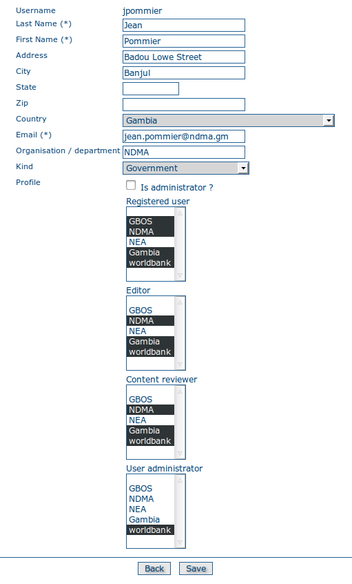

.. include:: ../substitutions.txt

.. _user_management:

Gestion des utilisateurs
========================

La gestion des utilisateurs passe par les fonctions de gestion d'utilisateurs native de |gn|, sauf pour la création de nouveaux calques cartographique (|gs|, voir :ref:`gs_user_profiles`).

|gn| structure ses utilisateurs à partir des concepts d'utilisateurs, de groupes et de profils utilisateurs.

- Un utilisateur appartient à un ou plusieurs groupes

- Un utilisateur possède un profil pour chaque groupe auquel il appartient. Ce profil peut être différent d'un groupe à l'autre. Il peut être relecteur dans un groupe, 
  et simple utilisateur enregistré dans un autre.
  
La combinaison des groupes et des profils utilisateurs définit quelles tâches un utilisateur pourra effectuer sur le système, ou sur des métadonnées précises.

Groupes
-------

.. note:: Seul un profil *Administrateur* peut éditer et créer des groupes.

Les groupes sont utilisés pour regrouper les gens par affinités. Habituellement, dans un géocatalogue, les gens sont regroupés par organisation ou par structure administrative.
Mais cela pourrait aussi être par projet.
Les groupes permettent de catégoriser les données et les droits d'accès. Par exemple, une donnée interne au ministère de la défense est susceptible de ne pas être rendue publique,
même envers d'autres ministères. Il peut être décidé de donner aux autres ministères un accès en lecture seule à la fiche de métadonnée (mais pas à la donnée elle-même), 
de sorte à les informer  que la donnée existe et qui contacter pour en savoir plus ; mais de cacher son existence aux utilisateurs non identifiés, au public.

C'est à ça que servent les groupes et le système de privilèges qui va avec.

Voir la `documentation sur les groupes <http://geonetwork-opensource.org/manuals/2.10.3/eng/users/admin/usersandgroups/index.html#creating-new-user-groups>`_ (en anglais)
dans la documentation |gn|.

Profils utilisateurs
--------------------



   Profil de l'utilisateur fictif Jean Pommier.

.. note:: Il faut un profil *Administrateur d'Utilisateurs* (ou *Administrateur*) pour pouvoir gérer les profils utilisateur.

Les profils utilisateur sont une extension de ce principe : un utilisateur donné dispose d'un compte, et de profils spécifiques définis pour chaque groupe auquel il appartient.

Un utilisateur donné peut être enregistré, par exemple, comme Administrateur d'utilisateurs pour le groupe "Risques naturels", mais être un simple relecteur sur le 
groupe "Ministère de l'intérieur".
Cela permet une gestion fine des droits d'accès, d'édition et de configuration du portail.


Voir `User Profiles documentation <http://geonetwork-opensource.org/manuals/2.10.3/eng/users/admin/usersandgroups/index.html#creating-new-users>`_ (en anglais) dans la documentation |gn|.

Propriété et privilèges
-----------------------

.. _ownership:

Propriété
`````````

Le créateur original de la métadonnée est considéré son propriétaire, au sein du système. Le propriétaire est considéré comme la personne référente, dans le sens du système, au sujet de 
cette métadonnée (attention ! dans la fiche de métadonnée, la personne déclarée comme référente n'a absolument pas besoin d'être la même !).

Le propriétaire de la métadonnée peut être changé en transférant cette propriété à un autre utilisateur.

Transfert de propriété
``````````````````````

Cela arrive essentiellement lors d'une mutation : quelqu'un change de poste, et les métadonnées dont il s'occupait doivent être gérées par quelqu'un d'autre.
Pour que cela se fasse facilement, il faut transférer la propriété de ses métadonnées à une autre personne.

.. note:: il faut un profil *Administrateur d'utilisateurs* au moins pour pouvoir réaliser un transfert de propriété.

Voir `ownership transfer <http://geonetwork-opensource.org/manuals/2.10.3/eng/users/managing_metadata/ownership/index.html#transfer-ownership>`_ (en anglais) dans la documentation |gn|.


.. _privileges:

Privilèges
``````````

Les privilèges sont la raison d'être de la structure par groupes : il est possible, pour une métadonnée, de définir différents droits d'accès (privilèges) en fonction des groupes.

Voir `privileges <http://geonetwork-opensource.org/manuals/2.10.3/eng/users/managing_metadata/ownership/index.html#setting-privileges-on-a-metadata-record>`_ (en anglais) dans la 
documentation |gn|.

.. note:: Les privilèges d'une métadonnée puvent être définis soit ar son propriétaire, soit par un *Relecteur* ou *Administrateur d'utilisateurs* du groupe auquel est associée la 
   métadonnée. Ou bien un *Administrateur*, bien sûr.
