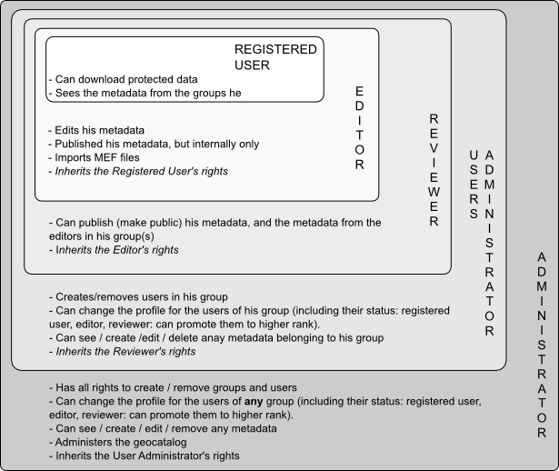

.. include:: ../substitutions.txt

.. _user_profiles:

Profils utilisateurs
====================

Dans les chapitres suivants, nous appellerons utilisateur toute personne enregistrée dans le portail, disposant d'un niveau d'accréditation (éditeur, administrateur, etc).

Les accréditations sont gérées séparément pour chaque application serveur : un utilisateur supposé gérer à la fois du contenu dans |gn| et |gs| doit être enregistré à 
la fois dans |gn| *et* |gs|. Ses identifiants et mot de passe n'ont pas nécessairement besoin d'être identiques pour les deux systèmes, même si c'est conseillé, pour plus 
de praticité.

.. _gn_user_profiles:

Profils utilisateur dans |gn|
-----------------------------



   Héritage des profils utilisateur
   
Il y a plusieurs niveaux de profils : 

- **Utilisateur basique** : non-identifié, ne peut pas se connecter. Il a seulement accès à ce qui est décrit dans le  `Manuel Utilisateur <../../../userdoc/html/index.html>`_.

- **Utilisateur enregistré** : il a accès à certaines métadonnées et données resteintes aux groupes auxquels il appartient.

- **Editeur** : dispose de droits limités. Pour l'essentiel, il peut créer des métadonnées, mais pas les publier (les rendre publiques). Ses métadonnées doivent 
  d'abord être validées par quelqu'un de profil plus élevé.
  
- **Relecteur** : comme l'éditeur, il peut créer des métadonnées. En revanche, lui, il peut les publier sans nécessiter de validation externe. Il peut aussi valider et publier des 
  métadonnées créées par un éditeur de son groupe. 

- **Administrateur d'utilisateurs** : joue un rôle de modérateur auprès de groupes de personnes. Il administre les relecteurs, éditeurs et utilisateurs enregistrés de son groupe.

- **Administrateur** : a tous les droits. C'est lui qui gère l'instance de |gn|.


.. note:: Il n'est pas nécessaire d'avoir du monde à tous les niveaux. Dans un premier temps, un ou deux administrateurs et quelques relecteurs devraient faire l'affaire. 
   Les nouvelles personnes entrant dans le processus de gestion des métadonnées devraient commencer comme éditeurs (il ne pourront pas faire de dégâts), puis lorsqu'ils se 
   seront familiarisés avec le fonctionnement du portail et auront fait leurs preuves, ils pourront être promus relecteurs ou au-dessus.
   
   Si le portail prend de l'ampleur, il peut devenir intéressant de confier les fonctions de gestion des utilisateurs aux diverses organisations impliquées : donner à chacune 
   de ces organisations un Administrateur d'utilisateur, qui pourra gérer en toute autonomie les utilisateurs (enregistrés, éditeurs, relecteurs) de sa propre organisation.

   Il n'est pas conseillé de multiplier le nombre d'administrateurs : dans la mesure où ils ont tous les droits, les choses peuvent rapidement devenir compliquées si les 
   administrateurs ne se concertent pas. Moins ils sont nombreux, plus ce sera facile.
 
.. _login: 
 
S'authentifier
``````````````
.. figure:: loggingin.png
   :scale: 50 %
   :align: right

   Authentification depuis le portail

pour s'authentifier depuis le portail saisir nom d'utilisateur et mot de passe dans le formulaire d'authentification, dans le coin en haut à droite, et cliquer sur *Connexion*.

Si vos paramètres d'identification sont corrects, le formulaire devrait être remplacé par votre nom. Placez la souris sur votre nom, et un menu devrait se déplier. 
L'entrée *Administration* vous conduira à la page principale de l'interface d'administration de |gn|. La plupart des autres entrées sont des raccourcis vers des fonctions 
d'administration.

.. note:: être identifié aura aussi d'autres effets, selon votre profil : cela ajoutera des options dans divers menus, des champs de recherche complémentaires dans le menu de 
   recherche du catalogue, et ajoutera peut-être même des calques disponibles dans le Référentiel de données géographiques (voir l'onglet *Sélectionner*).
 
 
.. _gs_user_profiles:
 
Profils utilisateurs dans  |gs|
-------------------------------

La gestion des utilisateurs dans |gs| est beaucou plus libre, moins structurée. Voir la documentation Geoserver, section `Security <http://docs.geoserver.org/2.5.x/en/user/security/index.html>`_.

.. note:: Avoir un profil dans |gs| n'est nécessaire que pour ceux qui veulent créer de nouveaux calques cartographiques à insérer dans le Référentiel de données cartographiques.
 