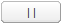
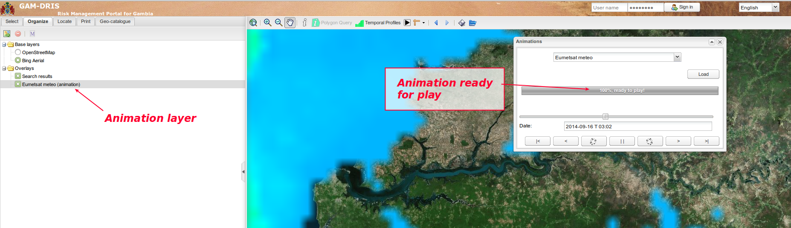

.. include:: ../substitutions.txt
.. |dashboard| image:: dashboard.png
.. |qmark| image:: windows_qmark.png
.. |anim| image:: animation.png
.. |fb| image:: fb.png
   :scale: 75 %
.. |b| image:: b.png
   :scale: 75 %
.. |pb| image:: pb.png
   :scale: 75 %

.. |pf| image:: pf.png
   :scale: 75 %
.. |f| image:: f.png
   :scale: 75 %
.. |ff| image:: ff.png
   :scale: 75 %
.. |pquery| image:: ../map/polygon_query_16px.png
.. |pan| image:: ../useTheMap/icon_pan.png

.. _advanced_tools:

Outils avancés
==============

.. index:: pair: Polygon Query; Control

.. _polygon_query: 

|pquery| Interrogation polygonale
---------------------------------

Présentation
````````````
L'outil d':ref:`interrogation<query_layers>` standard ne permet que d'interroger les données ponctuellement. Cela peut remplir bien des besoins, mais il arrive 
que l'on ait besoin de collecter des informations sur une surface plutôt que surdes emplacements ponctuels. Disons, par exemple, que l'on veuille savoir combien
de personnes vivent dans une zone à risque. Ou que l'on veuille déterminer l'altitude la plus faible, ou la plus élevée, dans un secteur donné. Cela sera impossible à 
réaliser avec une interrogation ponctuelle. Il faudra un outil d'interrogation polygonale.

Cet outil n'est disponible que pour certaines données s'y prêtant. Il faut d'abord avoir sélectionné un de ces données, puis dessiner sur la carte le polygône sur lequel 
collecter les informations.

Identifier les calques disponibles
``````````````````````````````````

Cela se voit depuis l'onglet *Organiser* (panneau de gauche) : les calques convenant à l'interrogation polygonale affichent une icône |pquery| (voir :ref:`layers_icons`).

En sélectionnant un tel calque (cliquer dessus avec la souris), cela devrait activer le bouton |pquery| *Interrogation Polygonale* dans la barre d'outils de la carte.

Utiliser l'outil Interrogation polygonale
`````````````````````````````````````````

.. figure:: pquery_usage.png

   Utiliser l'outil Interrogation polygonale.

Cliquer sur le bouton |pquery| *Interrogation Polygonale*, dans la barre d'outils de la carte : cela va basculer la souris en mode  *Interrogation Polygonale* et ouvrir 
une fenêtre à gauche, contenant du texte, mais pas de données encore.

Puis dessiner un polygône sur la carte : chaque clic de la souris va rajouter un angle ; un double-clic fermera le polygône et déclenchera la requête.

Cela devrait prendre un moment, le temps pour le serveur de calculer et retourner les informations.Celles-ci seront ensuite affichées dans la partie basse de la fenêtre 
mentionnée précédemment.

Dessinez un nouveau polygône, terminez-le par un double-clic, le résultat se mettra à jour en fonction.

Pour quitter le mode *Interrogation polygonale*, revenez sur un autre outil dans la barre d'outils de la carte. Par exemple l'outil |pan|.

.. _animations: 

.. index:: pair: Animation; Control

|anim| Animations
-----------------

Certaines données prennent tout leur sens si l'on peut explorer leur dimension temporelle. L'outil *Profils Temporels* fournit l'un des moyens d'explorer ces données.
Une autre façon consiste à jouer des animations, comme c'est couramment fait avec des données météo, par exemple.

Un "lecteur" a été mis en place pour ce type d'usage : l'outil *Animations*.

Les jeux de données disponibles pour le lecteur *Animations* sont définis par un administrateur. Un utilisateur du Portail peu choisir quel jeu de données animer, 
le charger et jouer l'animation, soit en boucle ou pas-à-pas.

Activer l'outil Animations
``````````````````````````

Pour activer l'outil, il suffit de cliquer sur le bouton |anim| *Animations* de la barre d'outils de la carte

.. figure:: animations_open.png

   Ouvrir l'outil *Animations*. Sélectionner la donnée à animer.

Une fenêtre s'ouvre. Vous devez d'abord choisir la donnée à animer, puis la charger (cliquer sur le bouton "Charger").

Une barre d'avancement vous tiendra informé de la progression du chargement : toutes les données se chargent avant de pouvoir jouer l'animation. 
Cela permet d'obtenir une meilleur fluidité par la suite.

Si vous chargez le jeu de données pour la première fois, cela prendra peut-être un peu de temps. Ensuite, cela devrait être rapide, les données étant 
conservées en cache dans le navigateur.

Quand le jeu de données est complètement chargé, la partie basse de la fenêtre devient accessible : la partie "lecteur", composée de :

- Un curseur, vous informant de la position au sein du jeu de données. Au départ, il se positionne sur la dernière image.

- Un champ texte précisant la date associée à cette image.

- Une rangée de boutons de contrôle de l'animation.

Vous pouvez jouer l'animation soit en déplaçant le curseur, ou bien en utilisant les boutons de contrôle.



   Les données sont chargées, le calque d'animation est ajouté dans la liste des calques de l'onglet *Organiser*.

Boutons de contrôle de l'animation
``````````````````````````````````

Il y a 7 boutons : 

- |fb| passe à la première (plus vieille) image. Si une animation est en cours, l'animation ne sera pas stoppée (pour ça, utiliser le bouton pause), 
  mais juste recalée sur la première image.

- |b| passe à l'image précédente

- |pb| bouton d'animation rétrograde : boucle sur les images, en jouant "vers l'arrière". L'animation continuera de jouer tant que vous ne presserez pas le bouton Pause 
  (ou le bouton d'animation "en avant", qui inversa l'animation).

- |pause| bouton pause : cela stoppera toute animation en cours.

- |pf| bouton d'animation "en avant": boucle sur les images, vers l'avant. L'animation continuera de jouer tant que vous ne presserez pas le bouton Pause 
  (ou le bouton d'animation rétrograde, qui inversa l'animation).

- |f| passe à l'image suivante.

- |ff| passe à la dernière image (la plus récente).  Si une animation est en cours, l'animation ne sera pas stoppée (pour ça, utiliser le bouton pause), 
  mais juste recalée sur la dernière image.

Calque associé à l'outil Animations
```````````````````````````````````

Lorsque vous commencez à jouer les images, un nouveau calque est ajouté dans l'onglet *Organiser*, nommé du nom du jeu de données animé. Vous pouvez l'utiliser comme n'importe 
quel autre calque de la carte : changer son opacité, le réorganiser par rapport aux autres calque, etc.

Si vous fermez la fenêtre Animations, le calque reste présent dans l'onglet *Organiser* et visible sur la carte. Cela vous permet de le visualiser sans formcément conserver 
la fenêtre quelque part. Si vous voulez supprimer le calque, décochez-le ou supprimez-le (clic-droit, choisir "supprimer").

.. note:: Attention, si vous fermez la fenêtre alors qu'une boucle d'animation est en cours, celle-ci continuera de jouer. Pour l'arrêter, ouvrez la fenêtre Animations à 
   nouveau (cliquer sur le bouton *Animations* de la barre d'outils) et cliquez sur le bouton *pause*).

.. _temporal_profiles: 


.. index:: Temporal Profile, NDVI, Soil Moisture, VCI, graphics


|dashboard| Profils Temporels
-----------------------------

Cet outil est activé en cliquant sur le bouton |dashboard| *Profils Temporels* , dans la barre d'outils de la carte.


.. figure:: ndvi.png
   :scale: 50 %
   :align: right

   Index NDVI, graphique des données annuelles

La forme du curseur de la souris change et devient un point d'interrogation |qmark|. Cliquer sur un emplacement de la carte où vous voulez obtenir des informations : 
cela ouvrira une fenêtre.

Celle-ci possède plusieurs onglets, un par jeu de données interrogeable :

- `NDVI <http://en.wikipedia.org/wiki/Normalized_Difference_Vegetation_Index>`_ (Normalized Difference Vegetation Index)

- Soil Moisture indicator (indicateur d'humidité du sol)

- VCI (Vegetation Condition Index)

Pour chacune de ces données, deux type de profils sont disponibles : 

- Données annuelles: sélectionner une année, faire "Appliquer" et les données sont récupérées, une valeur par décade (chaque 10 jours) et affichées dans un histogramme.

- Histoire d'une décade : sélectionner une décade (mois puis jour du mois), faire "Appliquer" et l'historique des valeurs prises par l'index au fil des années est affiché, 
  sous forme d'histogramme.


