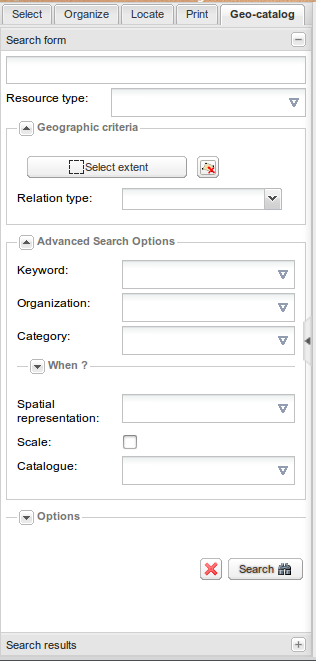
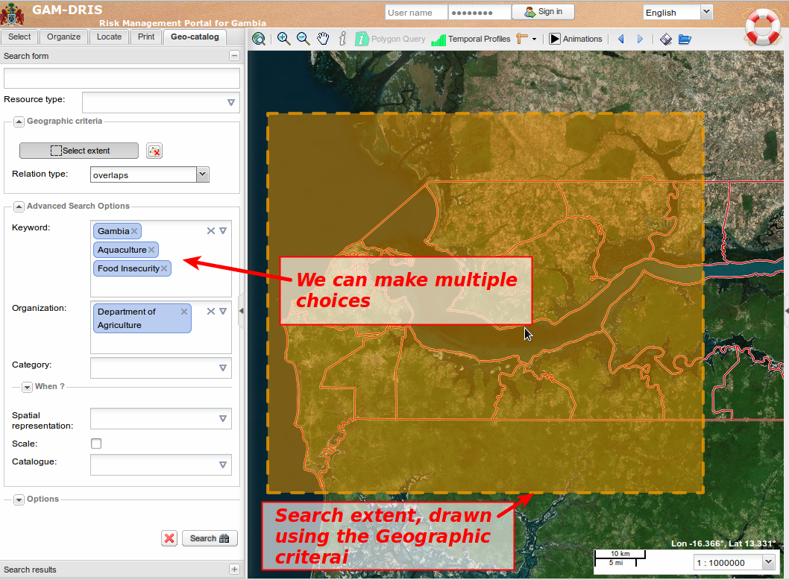

.. include:: ../substitutions.txt


.. |pan| image:: ../useTheMap/icon_pan.png


.. index:: Geo-catalog, Search, Metadata


.. _geocatalog:

Géo-catalogue
=============

Il s'agit du moteur de recherche du |project|. Il permet de réaliser des recherches au sein des données cataloguées dans la base documentaire.
Il est possible que dans un premier temps, le nombre de documents référencés soit limité et son utilité ne soit pas évidente de prime abord. Mais
avec le temps, le nombre de documents référencés va augmenter, et le catalogue va être un outil indispensable pour explorer les données stockées.

Formulaire de recherche
-----------------------



   Le formulaire de recherche. Les options avancées sont affichées.
   
Le formulaire présent dans l'onglet *Géo-catalogue* fournit des moyens puissants pour explorer le contenu du catalogue, en appuyant la recherche sur des 
champs précis des fiches de métadonnées. Chaque champ du formulaire définit un critère de recherche spécifique qui sera combiné aux autres pour produire la requête.

**Le premier champ du formulaire**, sans étiquette, **est un champ de recherche libre**, et
correspond au champ de recherche auquel nous sommes tous habitués dans les moteurs de recherche, celui de Google par exemple.
Les mots saisis dans ce champ de recherche seront recherchés dans l'intégralité du contenu des fiches de métadonnées. Chaque fiche contenant l'un des mots sera ajoutée 
dans la liste des résultats de la recherche.

Mais ce n'est qu'un début : vous pouvez ajouter d'autres critères de recherche, plus spécifiques : 

- **Type de ressource** :    la plupart des données sont catégorisées comme *Jeu de donnée*. Les *Série de données* correspondent à des séries, comme par exemple le jeu 
  complet des cartes topo à l'échelle 1/50 000. Les *Service(Web Map Service)* et *Catalogue d'attributs* sont plus rares et techniques.

- **Critères géographiques** : l'un des concepts des géocatalogues est justement de prendre en compte le positionnement géographique des objets. Il est donc, logiquement, 
  proposé  de prendre en compte ces informations lors d'une recherche.
   
  *  *Définir une emprise* : en cliquant sur ce bouton, vous pouvez dessiner sur la carte un rectangle d'emprise pour la recherche. Par défaut, toutes les données en contact
     avec cette emprise, même partiellement, seront sélectionnées. Ce comportement peut être changé grâce à la liste *Type de relation*.
     
     Si vous n'êtes pas satisfait par le rectangle dessiné, vous pouvez le redessiner autant que vous le vouler. Vous pouvez aussi le supprimer en cliquant sur le bouton
     |geogbb_remove|.
     
     Pour désactiver le bouton *Définir une emprise*, vous pouvez cliquer sur le bouton |pan| dans la barre d'outils de la carte.
  
  * *Type de relation* : permet de définir le rôle de l'emprise dessinée. Les plus intéressants : 
  
     - Chevauche : choix par défaut. Toutes les données dont l'étendue recouvre, même partiellement, le rectangle d'emprise sont sélectionnées. 
     
     - Contient : toutes les données dont l'étendue contient le rectangle sont sélectionnées. 
     
     - En dehors : les données situées hors du rectangle (pas de contact avec l'intérieur du rectangle et ses bords) sont sélectionnées. 
     
     - A l'intérieur : sélectionne les données dont l'emprise est strictement à l'intérieur du rectangle. 



   Recherche avancée en utilisant à la fois la définition de l'étendue géographique et des options avancées

- **Critères avancés** : ce sous-formulaire vous permet de définir plus de critères de recherche, plus spécifiques. Attention : si vous fixez trop de critères en même temps, 
  vous risquez de vous retrouver sans résultat...
  
  + *Mots-clés* : Vous pouvez saisir des mots-clés. Attention ! Ces mots-clés ne sont recherchés que parmis les mots définis comme mots-clés dans les fiches, pas dans le 
    contenu global de la fiche (utiliser le champ de recherche global pour ça). Si vous cliquez sur la flèche à droite du champ, une liste de mots-clés vous est proposée.
    L'auto-complétion est active sur ce champ : au fur et à mesure que vous tapez un mot-clé, le portail vous proposera des possibilités en fonction de ce qu'il a référencé.
     
  + *Organisation* : vous pouvez limiter la recherche selon l'organisation à qui appartient la métadonnée.

  + *Categorie* : GeoNetwork donne la possibilité d'associer des catégories à une métadonnée. Il s'agit d'une approche complémentaire aux mots-clés.
    Vous pouvez restreindre la recherche à certaines de ces catégories.

  + *Critères temporels* : par défaut, ce bloc est replié, donc invisible sauf son titre. Vous devez le déplier en cliquant sur la flèche à gauche du titre. 
    Il est utilisé pour restreindre la recherche en fonction de critères temporels :
     
     * Date de mise à jour des métadonnées : vous pouvez, par exemple, sélectionner toutes les données qui n'ont pas été mises à jour depuis au moins 5 ans. Ou, au contraire,
       les données publiées depuis moins d'un mois.
     
     * Étendue temporelle : même chose, mais sur les données elles-même, suivant ce qui a été défini dans les fiches de métadonnées. 
     
     * Il est possible de réinitialiser ces champs en cochant la case *N'importe quand*. 

  + *Représentation spatiale* : permet de filtrer selon le type de donnée : données raster, vecteur, texte, vidéo, etc. 
  
  + *Echelle* : si cochée, un curseur s'affiche permettant de définir la plage d'échelles à appliquer. 
     
  + *Catalogue* : le géocatalogue peut réaliser ce qu'on appelle du "moissonnage". Le moissonnage consiste à parcourir et référencer des catalogues externes, 
    par exemple le catalogue FAO, qui peut contenir des données pertinentes sur notre thématique. Ces catalogues moissonnés sont utilisés dans la recherche au même 
    titre  que les données locales. Ce champ vous permet de restreindre la recherche à un ou plusieurs catalogues.
  
- **Options** : permet de définir des paramètres d'affichage et de tri des résultats de la recherche. 

Finalement (mais il n'est absolument pas nécessaire d'avoir rempli tous ces champs de recherche !), vous pouvez déclencher la recherche en cliquant sur le bouton *Rechercher*.


Résultats
---------

A l'issue d'une recherche dans la base de données, le formulaire de recherche se replie et cède la place au panneau *Résultats de la recherche*. Ce panneau liste les 
résultats, 10 par 10 (pagination).


.. figure:: search_result.png
   :scale: 50 %
   
   Liste des résultats de recherche. En survolant un résultat avec la souris, une infobulle s'ouvre, affichant le résumé de la fiche. Dans la carte, les rectangles représentant 
   l'emprise de chaque résultat  de la page s'affichent, chacun d'une couleur différente et associée à son résultat. Le rectangle mis en évidence est celui du résultat
   actuellement survolé.


Liste des résultats
```````````````````

Chaque élément des résultats de recherche affiche : 

- Une case à cocher, pour sélectionner le résultat (vous pouvez réaliser des actions sur les résultats sélectionnés, depuis la barre d'outils du panneau, menu *Autres actions*).

- Le titre. Cliquer dessus pour ouvrir la fiche complète. 

- Le résumé. Tronqué s'il est trop long.

- La liste des mots-clés. 

- Une imagette d'aperçu (si disponible). Cliquer dessus pour afficher la version large. 

- Une liste d'icônes à droite, vous informant des fonctionnalités additionnelles accessibles pour cette donnée : 

  * donnés téléchargeables; 
  
  * données géospatiales que l'on peut afficher dans la carte; 
  
  * liens internet. 
  
  Ces icônes ne sont pas cliquables, mais donnent juste une information. Pour aller plus loin, il faut ouvrir la fiche de métadonnée complète (cliquer sur le titre). 
  *Penser à vérifier les droits d'utilisation de la donnée !*
  
- En bordure droite, une ligne de couleur permet de connaitre la couleur utiliser pour figurer l'emprise de cette donnée dans la carte. 

- En bas à droite, sous l'imagette, l'organisme référent est affiché, si disponible. 

- Si l'on survole le résultat pendant un instant, une infobulle est affichée. Elle contient le résumé complet. 

- Enfin, double-cliquer sur le résultat positionne la carte sur son emprise.


.. figure:: mtd_sheet.png
   :scale: 50 %

   Une fiche de métadonnées


Barres d'outils
---------------

Barre haute
```````````

La barre d'outils haute vous permet de :

- Trier les résultats selon différents critères.

- Sélectionner/désélectionner les résultats.

- réaliser des actions sur les résultats sélectionnés.Pour des utilisateurs non-enregistrés, les actions disponibles sont essentiellement limitées à des actions d'export, 
   dans différents formats. Un utilisateur enregistré dispose d'autres possibilités : éditer la métadonnée, la dupliquer, définir les privilèges, etc, selon son profil. 

Barre basse
```````````

C'est la barre de pagination : nombre de résultats, possibilité de passer à la page suivante/précédente.
