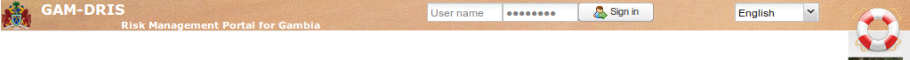

.. _introduction:
.. include:: ../substitutions.txt
.. |zoomin| image:: ../useTheMap/icon_zoomin.png

Présentation Générale
=====================

Afin de laisser un maximum d'espace à la fenêtre cartographique, les éléments ont été regroupés le plus possible.
La page se décompose donc en trois parties seulement : 

- l'entête

- le panneau cartographique, central. Il intègre aussi quelques outils, plus directement liés à l'outil cartographique.

- le panneau latéral, à gauche, qui contient l'essentiel des outils

.. figure:: layout.png

   Présentation générale

.. _header_panel:

Entête
------

   Entête
   
C'est le panneau le plus léger. Il a été réduit au maximum, pour optimiser l'espace fonctionnel.

- Le nom du site

- Le :index:`formulaire d'identification`, réservé aux utilisateurs enregistrés du portail (administrateurs, fournisseurs de données, etc)

- L'outil de sélection de language : le site est disponible en français et en englais.

- Le lien vers la page d' :index:`aide` : donne accès à plusieurs liens utiles, donc la présente documentation.

.. _central_panel:

Panneau central : la carte interactive
--------------------------------------

.. figure:: map.png
   :scale: 50 %
   :align: right

   Panneau central : la carte
   
Le panneau central contient la carte et l'essentiel de ses outils : une barre d'outils en haut, un encart d'échelle et coordonnées dans le coin en bas à droite.

La carte elle-même est interactive : vous pouvez déplacer le centre de la carte, zoomer avant/arrière, ajouter des calques de données, etc.

Par défaut, vous êtes en mode 'déplacement' : si vous gardez appuyé le bouton gauche de la souris tout en bougeant la souris, la carte va suivre votre déplacement. 
Le mode 'déplacement' est encenché en pressant le bouton *main* de la barre d'outils.

Vous pouvez zoomer avant/arrière, soit en tournant la molette de la souris, soit via l'un des boutons de zooms, à gauche du bouton *main* dans la barre d'outils.
Avec le bouton zoom avant (|zoomin|), vous pouvez dessiner un rectangle définissant la zone sur laquelle vous voulez zoomer.

Revenir au point de vue initial se fait via le bouton 'Zoom optimal' (le premier en partant de la gauche).

Revenir au point de vue précédent (et ensuite au suivant) peut se faire grâce aux boutons *historique*, les boutons aux flèches bleues.

Un certain nombre d'actions avancées sont également disponibles et sont documentées dans :ref:`advanced_tools`.

.. note:: Une infobulle est disponible pour chacun des boutons de la barre d'outils : elle s'affichera si vous laissez la souris survoler le bouton pendant un moment.

.. _left_panel:

Panneau latéral : le centre de contrôle
---------------------------------------

.. figure:: leftPanel.png
   :scale: 50 %
   :align: right

   Panneau latéral
   
Le panneau latéral se compose de plusieurs onglets : 

- L'onglet *Choisir* fournit une liste structurée de calques cartographiques organisés de façon hiétarchique. 
  Cocher un calque le rajoute dans la carte. Après avoir coché un calque pour l'afficher, il sera souvent nécessaire 
  de l'agencer correctement avec les autres claques affichés, définir son opacité, etc. Ca se fait dans l'onglet suivant:
 
- L'onglet *Organiser* est presque vide au départ. Il se remplit au fur et à mesure que l'on coche des calques depuis l'onglet *Choisir*. 
  Les calques cochés sont rajoutés dans le dossier 'Calques'. C'est là qu'on pourra les réorganiser, changer leurs paramètres d'affichage, demander leurs métadonnées.

- L'onglet *Localiser* rassemble quelques outils de positionnement : zoom par entités administratives, recherche d'un lieu dans une base de données externe de lieux géographiques.

- L'onglet *Imprimer* est le panneau de configuration d'impression.

- L'onglet *Géo-catalogue* est le formulaire de recherche de données, dans la base de métadonnées. C'est l'espace de recherche de la partie 'catalogage de données' du géoportail.

   
