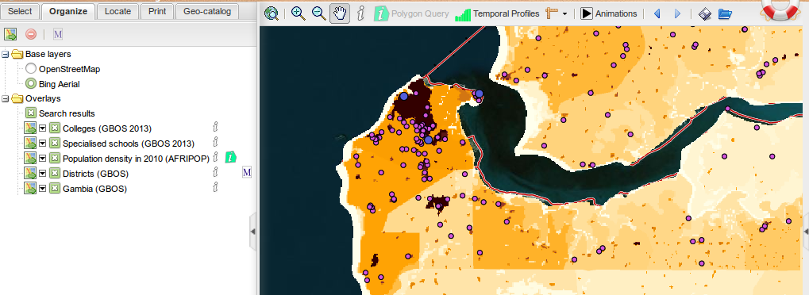
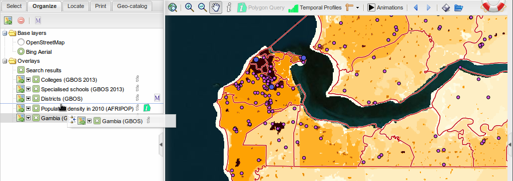
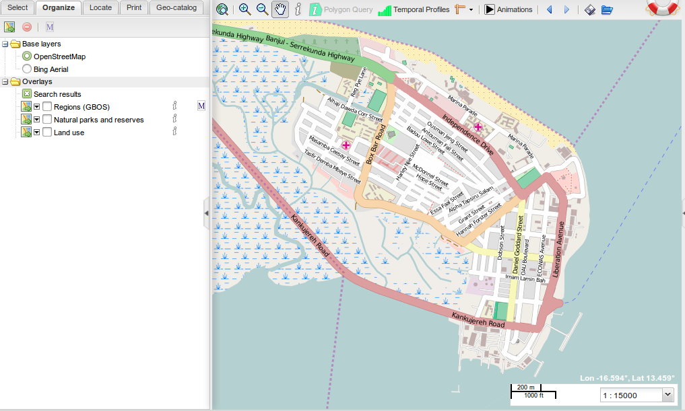
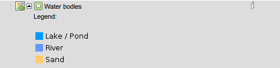
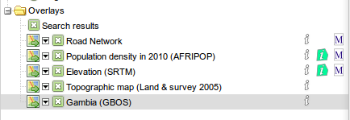
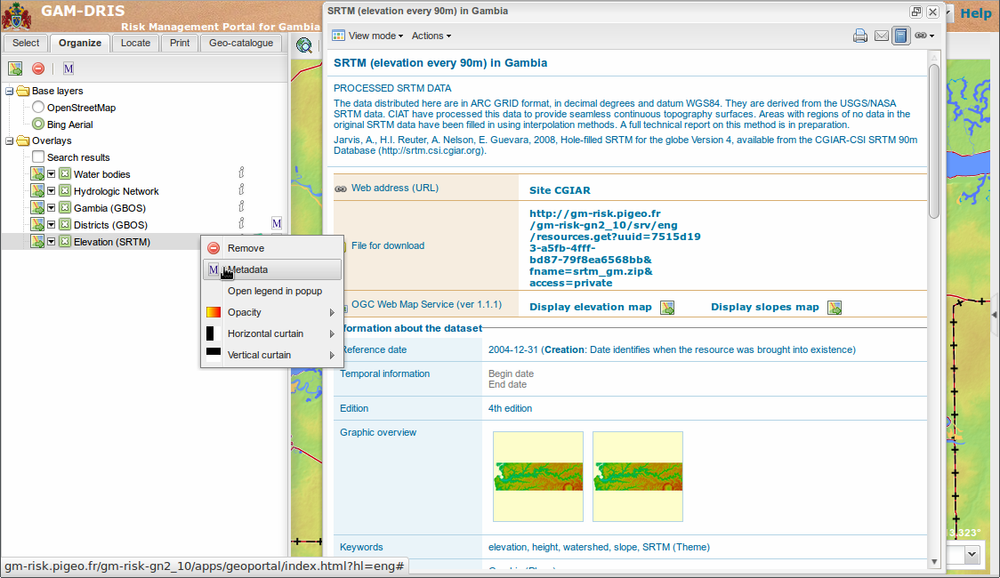

.. _map:

.. include:: ../substitutions.txt


.. |wms| image:: map_go.png
.. |chart| image:: chart.png
.. |i| image:: icon_featureinfo_16px.png
.. |M| image:: icon_metadata_16px.png
.. |pquery| image:: polygon_query_16px.png
.. |rm| image:: delete_layer.png

.. index:: Overlay, Layer


Building a map
==============

Most of the geoportal is about mapping: :ref:`select overlays <select_overlays>`, :ref:`organize overlays <organize_overlays>`, 
:ref:`compose them <manage_overlays>` in order to :ref:`print <print>` some maps. Here is a typical workflow using the map:

.. _select_overlays:

.. index:: pair: WMS; Layer
.. index:: pair: Chart; Layer

Select overlays
---------------

This happens in the :ref:`left panel<left_panel>`, first tab. Every checked layer is added to the map.

It is hierarchically organized, in a tree-like structure: unfold a folder to see what's inside. It can contain several kinds of *nodes*:

- other folders. Folders are represented with a |folder| when closed and a |folder_open| when open.

- WMS layers. They are the most common map layers. They are represented with a |wms| icon and a checkbox. 
 
- Chart layers. They are less common. They will show as pie or bar charts, at some locations on the map. They are represented with a |chart| icon and a checkbox. 

Some *nodes* have a description: it will pop-up when leaving the mouse over for a second.


.. _organize_overlays:

Organize overlays
-----------------

This is the function of the second tab, the *Organize* tab. 

The layers checked in the *Select* tab are initially stacked as they come, in the tree-like structure. 



   Layers stacked as they come: administrative boundaries are hidden underneath the Population (opaque) layer.
   
Sometimes, it will be good, but most often this will not be the right order, it will be necessary to reorganize them. This is the main purpose of this panel.
Reorganizing the layers is simple: just click on the layer to move, keep the mouse pressed and move the layer to its new place. The place where it will be inserted is shown by a dotted line.
When in the right place, release the mouse's button.
   


   Reorganizing the layers
   
   
.. _change_background_map:
   
.. index:: pair: Background; Layer
   
Change the background map
-------------------------

The default background map is a Bing Aerial map. It is possible to change it for OpenStreetMap background.
The background choice is in the *Base Layers* folder, in the *Organize* tab



   OpenStreetMap background on Banjul
   
.. note:: OpenStreetMap images are easier to compress, and will result in less bandwith requirements than Bing Aerial. so if you have no need for Bing Aerial 
          background, you may prefer using OpenStreetMap
          
.. note:: Bing maps are not supported for printing (licence issue). The right background for printing is then OpenStreetMap
   

.. _manage_overlays:

Manage an overlay
-----------------

View the legend
```````````````

For most of the overlays, there is a small downward arrow, just left of the checkbox. Clicking this arrow will unfold the legend underneath the overlays' row.
Clicking it again will fold the legend.



   Unfolding the legend
   
For some layers (scanned maps), the legend is very large and will not be readable in the panel (not large enough). It is then possible to open it in a pop-up window: 
right-click on the overlay, and select '*Open legend in popup*'.

.. figure:: legendInPopup.png

   Soil association layer comes from a scanned map. Its legend is too large for an easy display. The best way then is to open it in a separate pop-up window.


.. _layers_icons:

Information about the overlay
`````````````````````````````

Some icons on the right of the layer's name tell the user which information tools are available for this layer:

- |i| says the layer is *queryable*, meaning you can use the :ref:`Query <query_layers>` tool on this layer.

- |pquery| says the layer is enabled for the :ref:`Polygon Query <polygon_query>` tool.

- |M| says some metadata are available for this layer.

They are just informative icons, telling the user which actions he will be able to perform. Then, each of these
actions will be trigged in their own way (see further).



   Here, all the layers are queryable, Population density and Elevation are enabled for Polygon Query and have a metadata sheet available. 
   Road Network too, has a metadata sheet.

View Metadata
*************

A layer having metadata will be represented with the |M| indicator. When selected (left-click on it), the |M| button on the panel's top toolbar will be activated. 
On the layer's context menu (right-click on the layer), the *Metadata* entry will be activated too.

Clicking on one of those will open the metadata sheet, if you have access rights to this metadata. Otherwise, a message will tell you don't have the access rights 
(meaning the access is restricted to some registered users: you have to log in).



   Opening the metadata sheet (on the right)
   
See also the :ref:`geocatalog` section about metadata.

Use transparency / curtain ('*swipe*') controls
```````````````````````````````````````````````

.. index:: pair: Transparency; Control

Transparency
************

It is possible to make a layer partially transparent. This allows to overlay several layers, for example overlay hillshade data over a topographic map, to add some
elevation effect on the map.

.. figure:: opacity.png

   Overlapping slopes information over a topographic map enhances the map with some 3D effect...

A right-click on a layer opens a contextual menu, with some actions available for this layer. One of these actions is called '*opacity*', and opens a slider. 
By moving this slider, on can change the layer's opacity from 1 (completely opaque) to 0 (invisible). 

.. note:: Setting the opacity to 0 (invisible) will automatically uncheck the layer. It is important to remember it, since unchecked layers are automatically 'cleaned' 
          from the Organize tab.
          
.. index:: pair: Curtain; Control

Curtain ('*swipe*') controls
****************************

Sometimes, one want to compare two overlapping layers. One way of doing this is to use the transparency. Another way, keeping both layers' full opacity, is to use the curtain controls.

It works as if the active layer were a curtain: folding the curtain leaves room to what lies behind. Moving the curtain over the layer lets the user see, on this cleared area,
the underlying layer.
Curtain control is available both for vertical and horizontal directions.

Open the contextual menu by right-clicking on the layer, position the mouse over the proper curtain (horizontal or vertical) and move the slider.


.. figure:: curtains.png

   Using the horizontal curtain to compare locally the Soil association map with the Land Use data

.. note:: Don't forget the curtains settings are persisted for this layer, even if the layer is removed from the Organize tab. It will reset only after reloading 
          the page in the browser. It is of course possible to reset the curtains manually by moving the sliders back to their initial positions.
          
.. note:: The maximum number of layers one can compare using the curtains is 4, letting one layer for each quadrant. It is even possible to use transparency 
          to combine some more layers. But this is an extreme scenario !

Remove the overlay
``````````````````

There are three ways to remove a layer from the map and from the Organize tab:

- Choose '*Remove*' in the contextual menu.

- Select the layer and choose the |rm| button from the toolbar on the top of the panel.

- uncheck the layer, change tab and come back again.

.. note:: This last solution uses the 'auto-clean' functionality of the Organize tab: every unchecked layer is removed, when one changes tab. 
          This allows to keep the Organize panel quite well ordered. 

Add other layers
----------------

Add an external WMS layer
`````````````````````````

It is possible to add overlays from external cartographic services, through the first button in the tab's toolbar (Add WMS). 
WMS means Web Map Service. This tool allows you to look in a list of available services, or to add a new one (you must know its WMS URL). 
It then lists the available overlays associated to this service, and you can choose a add some of them to the map.

Add a layer from the catalog
````````````````````````````

Its is also possible to add overlays from a search in the :ref:`geocatalog`. When overlays are attached to a metadata, it is possible, 
by clicking the icon, to add them to the map. This operation will be explained in the :ref:`geocatalog` section.
