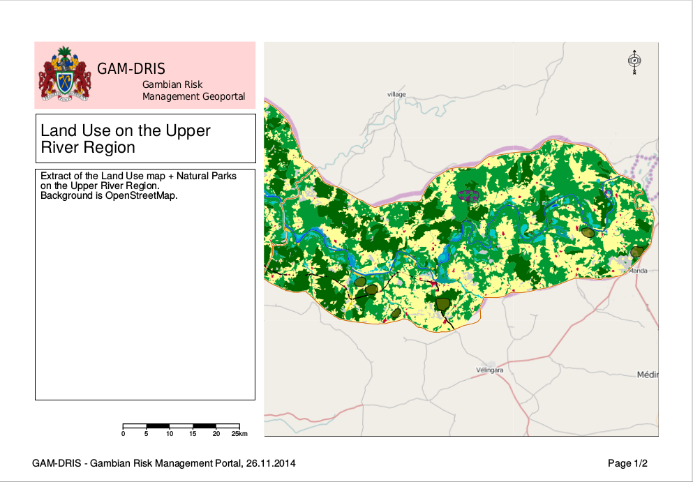

.. _print:
.. include:: ../substitutions.txt

.. index:: PDF, Print

Imprimer
========

La fonction d'impression permet de générer une page PDF composée d'un extrait de la carte, d'un titre, de commentaires et de la légende.
Cette page PDF peut ensuite être imprimée, envoyée, ou intégrée dans un autre document.

   Impression, première page
   
L'onglet Imprimer
-----------------

L'impression est contrôlée dans l'onglet *Imprimer*. Il contient un formulaire où vous pourrez définir le titre, les commentaires à incorporer
ainsi que plusieurs paramètres d'impression.

Lorsque vous basculez sur l'onglet *Imprimer*, un rectangle orange s'affichera sur la carte. Il représente l'étendue qui sera prise en compte pour l'impression.
Le rectangle reste automatiquement centré sur le centre de la carte. Sa taille est déterminée par le champ *Echelle* du formulaire. Par défaut et à chaque fois que le carte est 
actualisée, le portail essaie d'optimiser l'emprise de l'impression par rapport à la vue en cours.

.. figure:: print_form.png

   Formulaire d'impression à gauche, rectangle d'emprise, orange, en surimpression sur la carte.

Un bouton *Générer le PDF*, en bas, déclenche la fabrication du document PDF. Cela peut prendre un moment, car le document est généré côté serveur et nécessite d'executer
un traitement sur les données des calques actifs.

Lorsque la génération est faite, le navigateur vous retourne un document PDF à visualiser avec votre lecteur PDF, ou a enregistrer sur le disque dur.

.. note:: Attention : comme stipulé dans l'onglet *Imprimer*, les fonds de carte Google et Bing ne peuvent pas être utilisés pour une impression, à cause des licences restrcitives 
   imposées par ces compagnies : l'utilisateur peut visualiser les données, mais pas les exporter ni les imprimer.
   
   Il est donc recommandé d'utiliser un autre fond de carte pour l'impression : OpenStreeMap fait très bien l'affaire, ou n'importe quel calque qui couvre entièrement toute 
   la zone à imprimer.