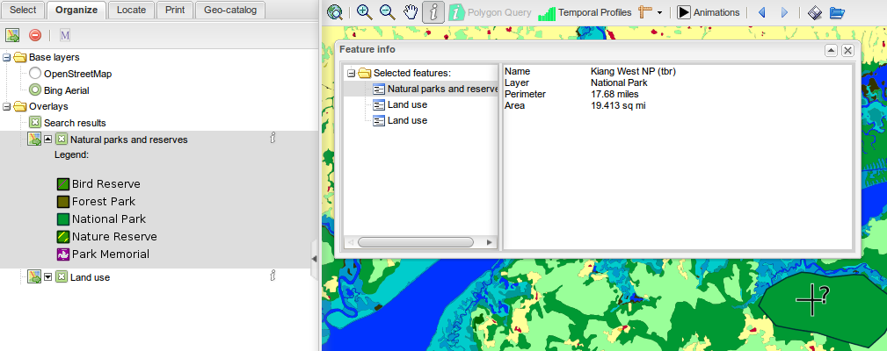
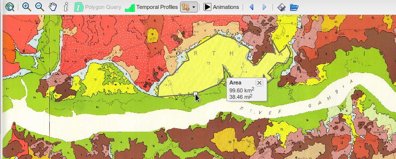

.. _use_the_map:

.. include:: ../substitutions.txt
.. |measure_area| image:: ruler_square.png
.. |measure_line| image:: ruler.png
.. |history_prev| image:: resultset_previous.png
.. |history_next| image:: resultset_next.png
.. |zoomout| image:: icon_zoomout.png
.. |zoomin| image:: icon_zoomin.png
.. |zoomfull| image:: icon_zoomfull.png
.. |savewmc| image:: icon_savewmc.png
.. |pan| image:: icon_pan.png
.. |loadwmc| image:: icon_loadwmc.png

.. |icon_submenu| image:: icon_submenu.png


Using the map
=============

Manipulating the map is mostly done using the mouse and the map's top toolbar.

|zoomfull| |zoomin| |zoomout| |pan| Zoom in, zoom out, pan the map
------------------------------------------------------------------


.. index:: pair: Zoom; Control

Zoom
````
Zooming in or out can be performed by simply scrolling the mouse's wheel.

It can also be done using the three first buttons on the map's top toolbar:

- |zoomfull| will reset the map's position and zoom.

- |zoomin| switches the mouse in *zoom in* mode. While in this mode, it is no longer possible to move the map. Click with the mouse to draw a rectangle. 
  The application will zoom the map the closest possible to this rectangle. A single click (no rectangle) will zoom one level closer.
  
- |zoomout| switches the mouse in *zoom out* mode: a mouse click will zoom the map one level farther, centered on the click.

One last way to zoom in is to press the *shift* key, click with the mouse and draw a rectangle. This can be one while in *pan* mode, and is simpler than 
switching to *zoom in* mode.

.. index:: pair: Pan; Control
.. index:: pair: Move; Control

Pan
```

Along with zooming in/out, it is necessary to be able to move the map.
Actually, this is the default tool, activated at startup.

Select |pan| to switch to *pan* mode. In this mode, to move the map, click on the map, keep the mouse pressed and move the mouse. Release when done.


.. _query_layers:

.. index:: pair: Query; Control
.. index:: pair: Query; Layer

|featureinfo| Query layers
--------------------------

Select |featureinfo| to switch to *query* mode. While in *query* mode, click somewhere on the map to retrieve the layers' values on this point.
Only queryable layers (see :ref:`layers_icons`) will be queried.

The query can take some time, as it requests the information from the map server.

The result is displayed in a pop-up window:

- on the left part are listed all the layers that have returned values. Sometimes, a same layer appears several times: this means it returned several records 
  (often happens when querying on a polygon intersection, or on a stacked group of points). Sometimes a layer doesn't appear at all, if it has no data at this place.
  
- on the right are displayed the informations (data) for the layer selected on the left panel. Select another layer, the informations will update accordingly.

The queried location is shown on the map using a |query_marker| marker.



   Both layers are shown as queryable in the Organize tab. Querying on a place where both layers have data (a polygon, for the Natural parks layer) returns one value 
   for the Natural Parks layer and two for the Land Use layer (must have fallen on a boundary between two polygons).

To quit the *query* mode, you can switch back to *pan* mode.

.. index:: pair: Measure; Control

|measure_line| Measuring
------------------------

The |measure_line| button is actually a two-fold button. Clicking on the button itself will activate the *Distance Measurement* tool. But clicking on the |icon_submenu| 
icon just on the right of it will open a submenu to choose between *Distance Measurement* (|measure_line|) or *Area Measurement* (|measure_area|) tool.

Both tools work in a similar way.

To measure a distance, select |measure_line| and draw the line on the map: each left-click with the mouse will draw a corner. Starting with two corners, it makes a line 
and the measure gets displayed. A double-click will end the measurement.

Measuring a surface is done the same: starting with the third corner, it makes a polygon and the measured area gets displayed.



   Measuring the covered area of a river floodplain area, on the Soil association overlay.


.. index:: pair: History; Control

|history_prev| |history_next| History
-------------------------------------

Using the arrows buttons |history_prev| and |history_next|, you can go back/forward in the previous zoom views, a bit like the history arrows of a web browser.


.. index:: pair: Save (map); Control
.. index:: pair: Restore (map); Control

|savewmc| |loadwmc| Save/restore the map
----------------------------------------

You can save the map configuration, for further reload. It allows you to suspend a working session and restore it later, in order to get back to where you were last time. 
Or to send the file to a colleague, that could restore the same environment you were working in.

This is done using WMC, *Web Map Context* protocol. This is a standardized way to store a map's composition.

Saving is done using the |savewmc| button. It will offer you to save a file with a cml extension. This is the file that will contain all the necessary information to 
further restore the map's composition. Save it somewhere on the computer, or send it to the persons with whom you want to share the map.

Restoring the composition is done using the |loadwmc| button, selecting the file on the computer, and pressing *Load* button. Choosing *Merge* button would add 
the layers in to the current map. Load will replace the current map with the saved one. 